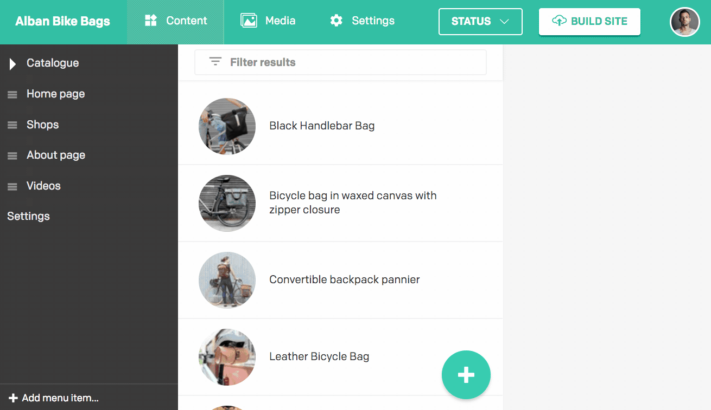

Everytime a new model is created, a new navigation item is automatically added in the sidebar present in the **Content** tab of your administrative area, so that editors can start creating new content right away:

While this is a great, big websites tend to require a significant number of models to properly manage every page, so for client/editors it might quickly become difficult to understand which model of the backend is linked to which part of the frontend website.

You can easily organize the different models in a more understandable way renaming, reordering and grouping them, so that their purpose will be more clear to the final editor:

