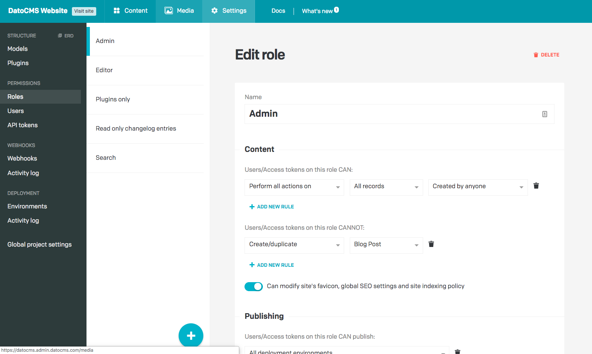
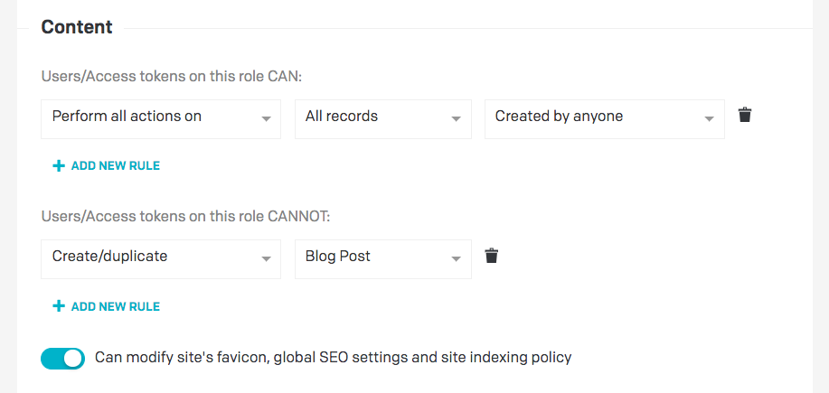

DatoCMS offers a thorough roles and permissions system that allows you to precisely specify what actions every team member can perform (ie. *"read-only permission on every content, except for articles which can be freely created/updated but not deleted nor published online"*).

The access to content is managed separately and independently in each DatoCMS project: Jack can have full ownership of project A, but be just a proofreader in a project B.

Every DatoCMS project is automatically populated with the following roles, but you are free to create as many roles as you want, and assign them both to users and API tokens:

* **Admin:** Can do everything, including work with records, create and update models, configure project settings and work with API keys.
* **Editor:** Can work with records, does not have access to models, API keys or project settings.

For each role you can specify what the user is allowed and not allowed to do.

The access is specified by:

* **Action:**
  1. Read
  1. Create/duplicate
  1. Edit
  1. Publish/unpublish
  1. Delete
  1. Edit creator

* **Model:** it's possible to give full access (everything allowed) to the model `meal`, but give zero access (can't even read) to the model `drink`.
* **Creator:** it's possible to enable opening only the content which the user has created themselves (on users with its same role), and deny opening content created by other users.

The most important aspect is *everything which is not explicitly allowed is denied*. Here's an example: if you've enabled editing records, but didn't enable reading them, then the user won't be able to open the records. Even though it might feel counter-intuitive, this way of handling access rights helps preventing unsolicited access: when you set up everything explicitly, there is no chance of accidentally giving someone access to something they shouldn't have.

