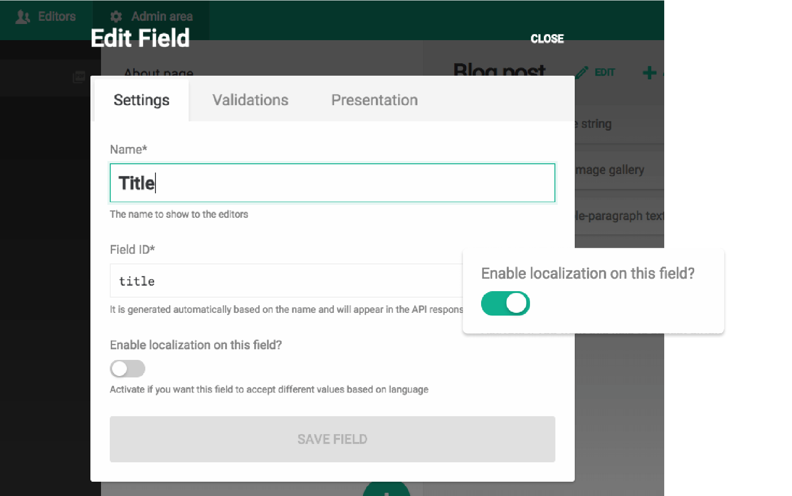
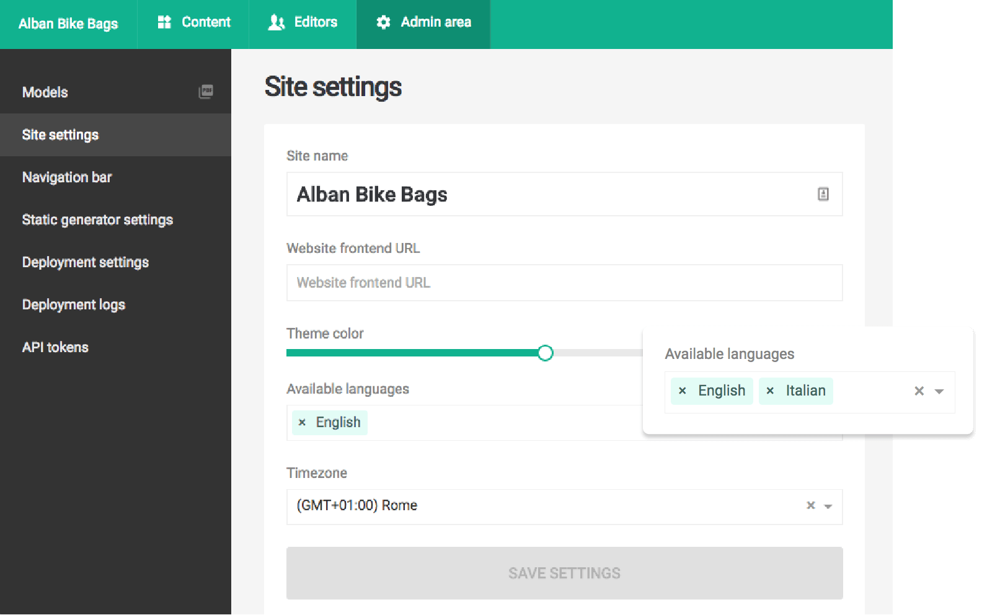
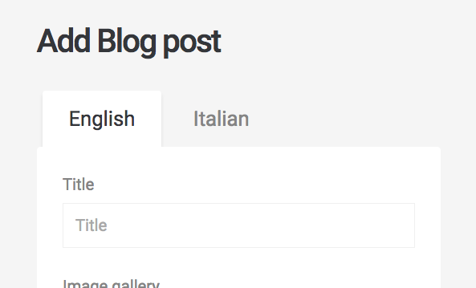
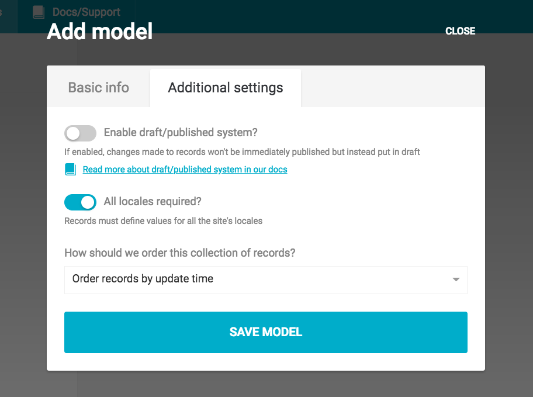

Each administrative area in DatoCMS supports multiple locales, defined by the short ISO locale codes (ie. `en` or `de`). You can add or remove locales within the *Admin area > Site settings* section:

Each field is localized individually, so you can pick and choose which specific content needs to be translated and which not:

As soon as a localized field is present within a model, the form to edit its records will present one tab for each locale:

## Adding new locales along the way

With DatoCMS you are free to add new locales at any time; just be aware that, once a new locale is added, if some validations are present on your fields, those validations will be enforced for every locale. Records already created will therefore be marked as "invalid", and you won't be able to update your records until all the validations are satisfied for all the locales. For more information, take a look at the [Data migration](/docs/content-modelling/data-migration) chapter.

## Optional/required locales

You can configure a certain model so that your editors are not forced to insert content for every language your project supports, but just for some of them, on a per-record basis.

This allows use cases such as multi-language blogs, where some articles can be written only in English, other only in Italian and others in both languages.

You can enable optional translations unchecking the *All locales required?* option in your model settings:

