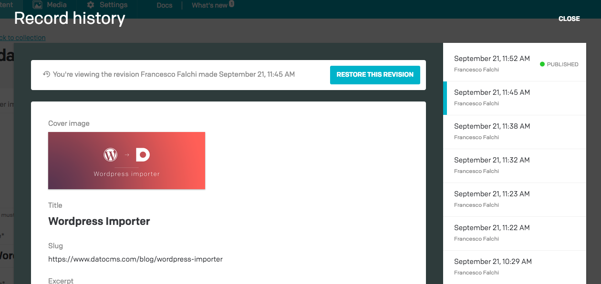

DatoCMS produces a snapshot of a record each time it gets saved. 

Record versioning allows DatoCMS users to view previously published versions of the record, find out who published a record, compare previous snapshots to the current version, and — when necessary — restore the content to the earlier state.

DatoCMS stores all the content found in the record — including localized content and references to other records and uploads — but it does not create or store snapshots of linked entities. Thus, if you restore a record to the earlier version containing a reference to a deleted upload, the image field will be empty.

It is also important to remember that the version comparison only displays current locales and values. If your record was translated into Italian in the past, but later the Italian locale was removed from the model, the Italian text will no longer be visible or restorable. 

The same logic goes for deleted fields: any content that was stored within these fields in the past will no longer be displayed.
