In the Media Area of your project you can upload, see, edit and organize all your assets.

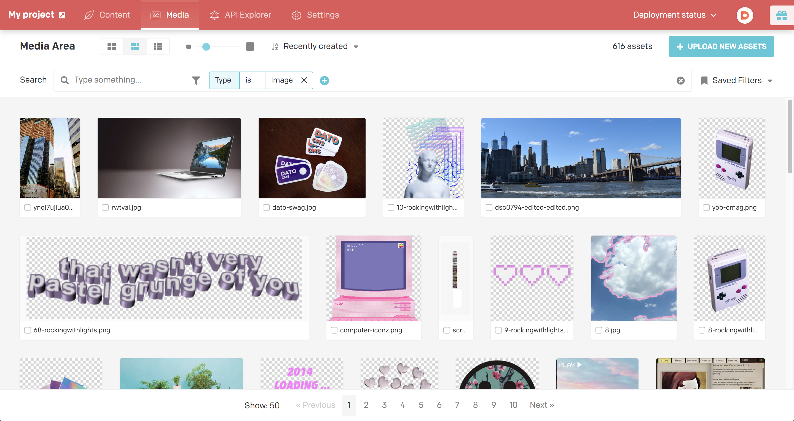

Each single asset can be seen with its information and edited.

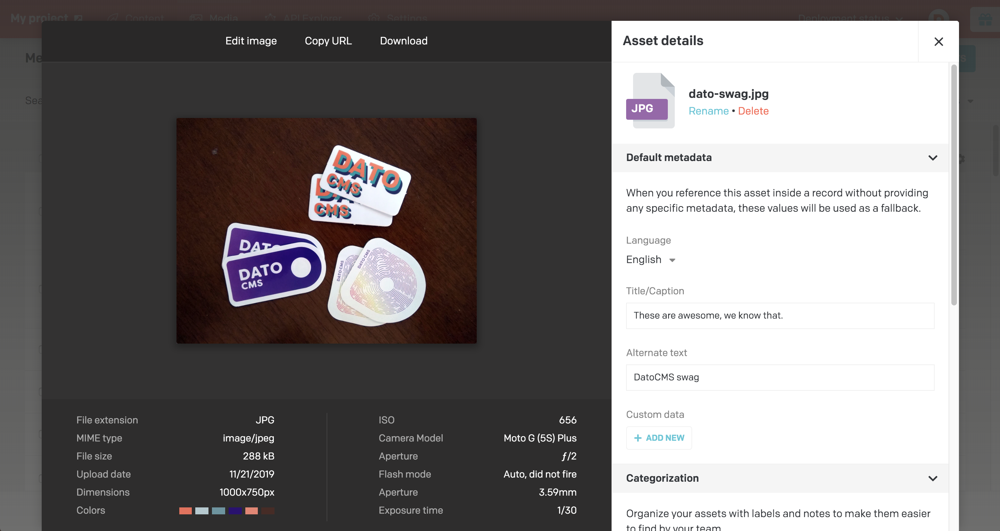

### Asset organisation

With a growing set of assets you might need to organize them. To do that we offer a few different options.

You can filter on any number of fields with a set of options for each field:

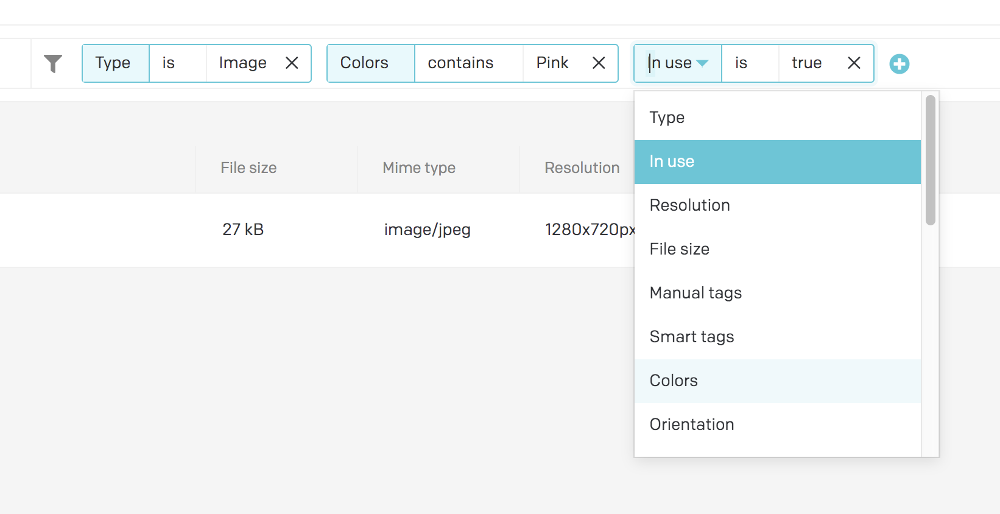

If you have a useful filter that you want to save or share with the rest of the team you can add it to your "Saved filters":

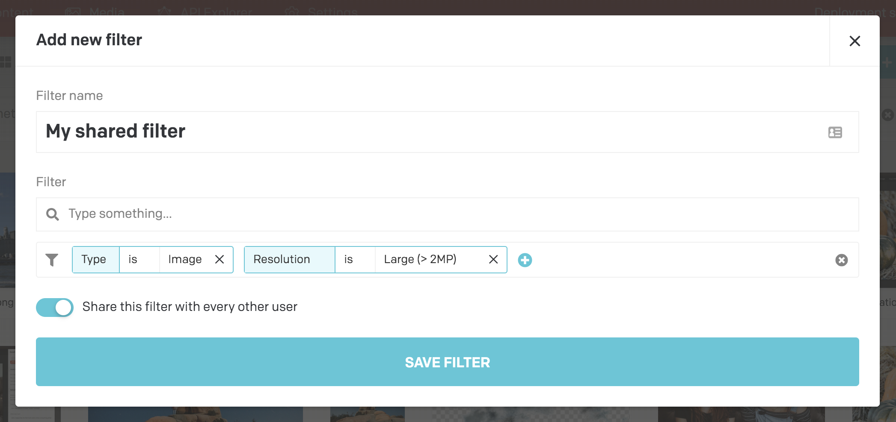

One way to organize assets that we recommend is to **combine filters with tags**, both manually added and machine learning-based smart tags, automatically added on asset upload.

You can efficiently tag leveraging the bulk tagging:

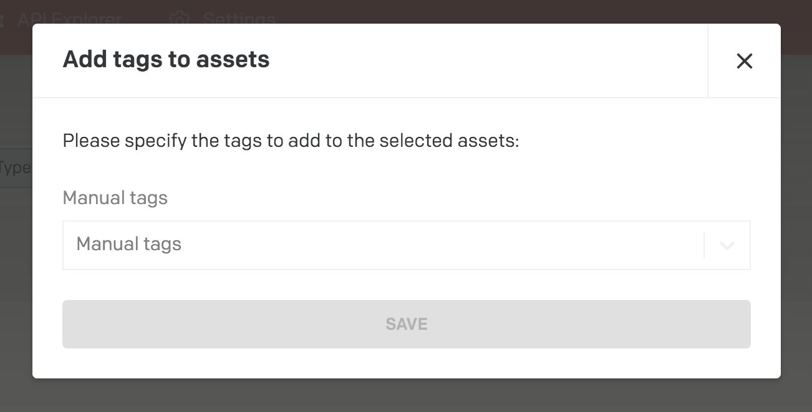

And finally you can visualize your assets in various ways, depending on your use case and asset shape. For example, the tabular mode can be very handy to perform operations on multiple assets at once:

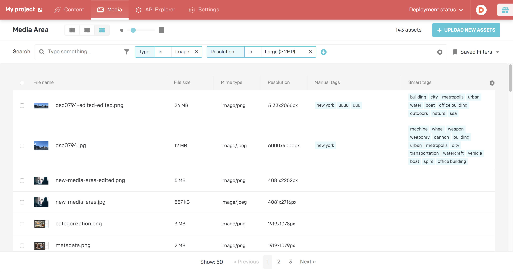

### Asset management

For each asset you can specify a set of default metadata such as title and alternate text that can be applied as a default value when nothing else is selected.

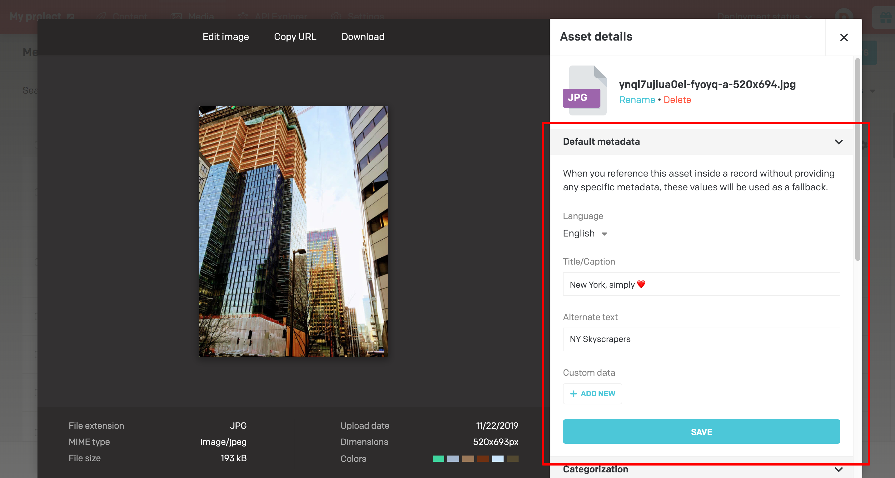

For better asset organisation you can specify some additional categorization fields, such as notes for colleagues and author/copyright data of the asset:

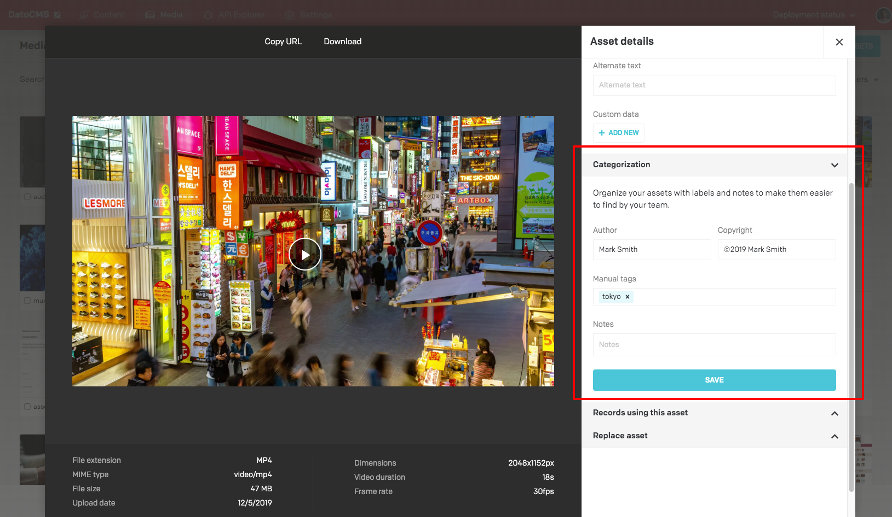

If you need to add a new revision of an asset you can simply drag a new version and we'll replace the asset in every occurrence:

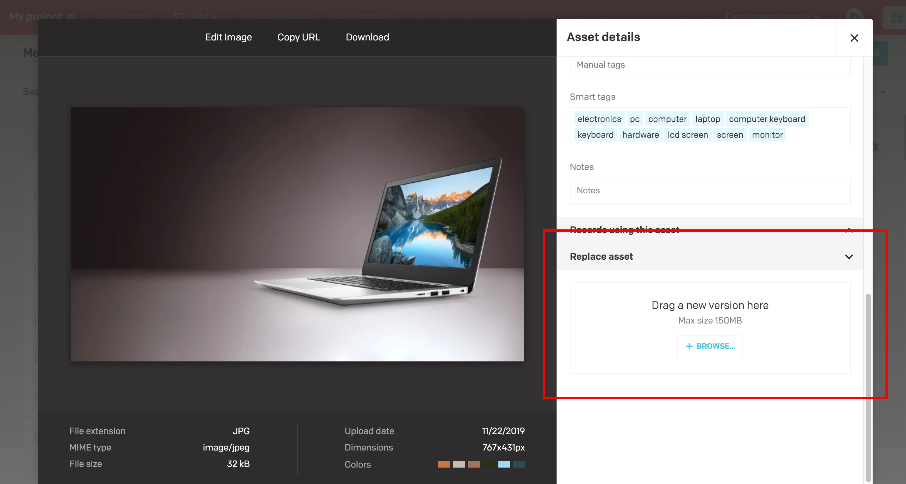

### Localisation

In case of multiple locales you are able to set default metadata on a locale basis:

And then override them in place when referincing the asset in a record:

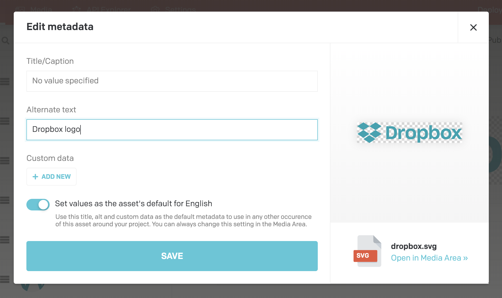

### Audio player

If you host/produce audio files, you can use the embedded audio player to listen them:

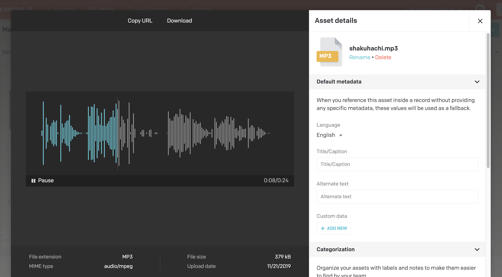

### Image editor

If you need to edit an uploaded image you can now edit in place with a powerful editor that allows you to crop, rotate, apply some predefined color filtering, tweak the colors and apply some basic shapes and text on the picture:

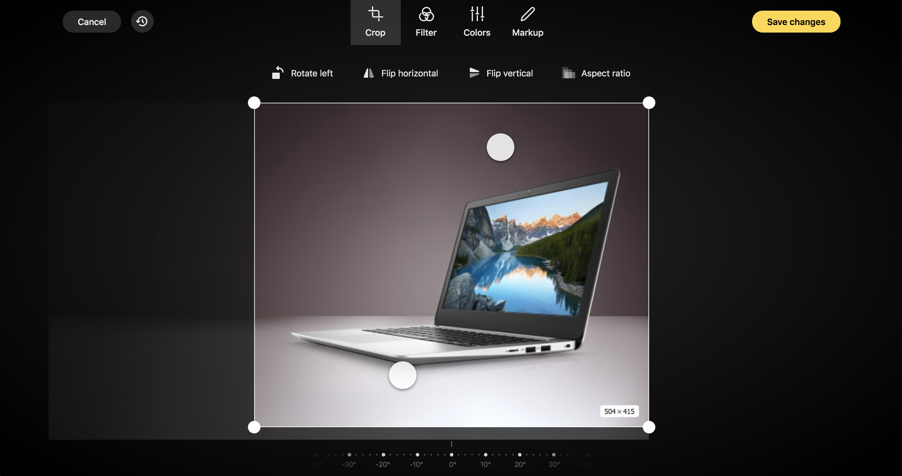
