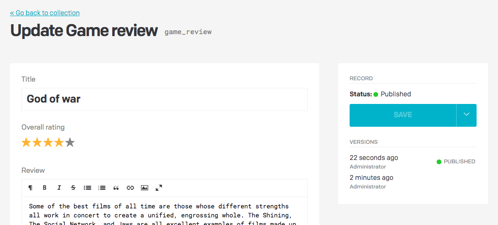
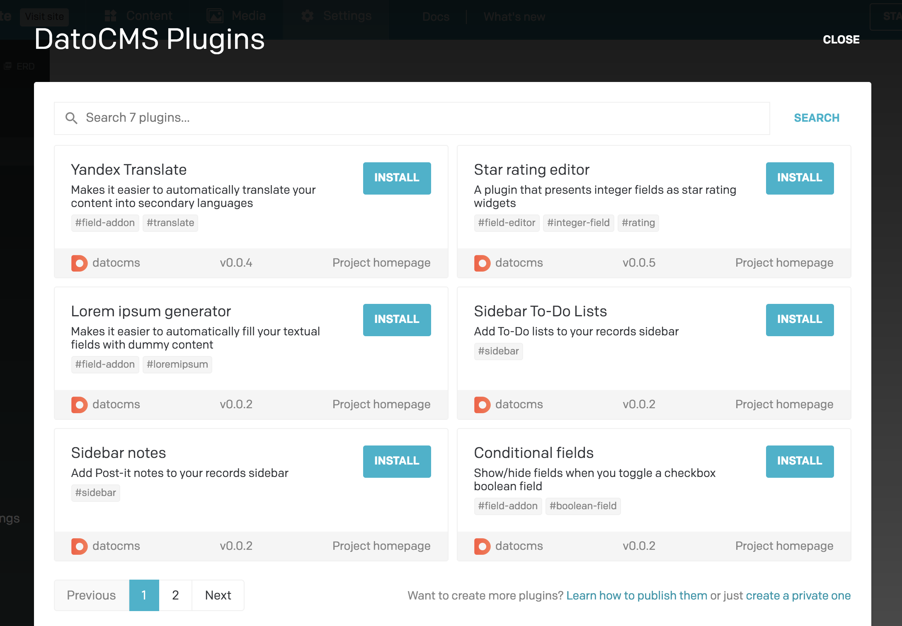

While DatoCMS offers a great number of fields with different appearance configurations, we cannot cover every possible scenario. Plugins enable developers to replace the default fields that DatoCMS provides with third-party HTML5 applications, so the editing experience of your administrative backend can be fully customized.

Just as an example, the [Star rating plugin](/plugins/i/datocms-plugin-star-rating-editor) will present an Integer field with a star rating widget instead of using the default textual input:

The community of DatoCMS users has released a number of different plugins. You can install them in one click under the *Settings > Plugins* section of your administrative area:

### When is it useful to use plugins?

#### Better authoring experience

When the fields provided by DatoCMS do not meet the specific requirements of your content editors, plugins can be created to customize the DatoCMS administrative area to fit the authors' needs. Some examples might be:

* To make JSON data editable using a custom interface;
* Displaying the difference between draft and published states of a field,
* A way to have some field calculated based on some others.

#### Third-party integrations

You can also use plugins to communicate with external APIs and integrate third-party data in DatoCMS, for example:

* Translating text from one locale to other locales using external translation APIs,
* Fetching product details from an external e-commerce website (Shopify, Commerce Layer) and embedding it in DatoCMS.

### Learn more

Learn how to build new plugins or install existing ones [in our detailed guide](/docs/guides/building-plugins).
