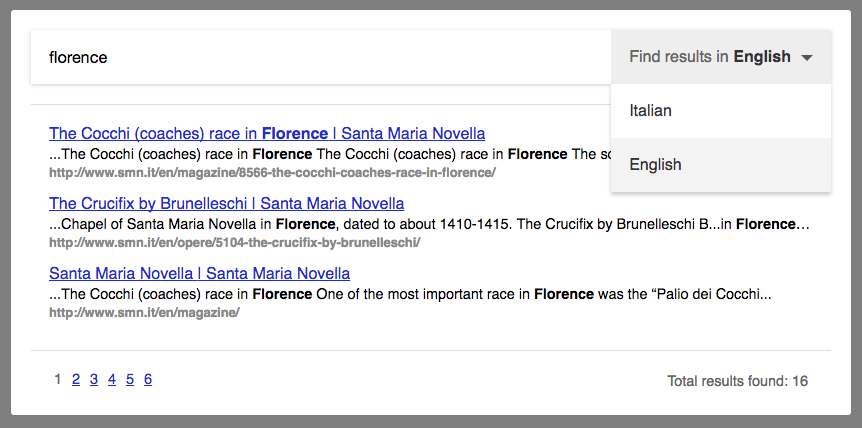

DatoCMS *Site Search* is a way to deliver tailored search results to your site visitors. You can think of it as a replacement for the now discontinued Google Site Search.

There are many third-party services out there that fill this need ([SwiftType](https://swiftype.com/), [Algolia](https://www.algolia.com/), [Cludo](https://www.cludo.com/)). Our solution seeks to be the best deal for the majority of websites:

* extremely easy to integrate with your static website;
* completely customizable in terms of look & feel;
* works without the need to tweak any setting;
* handles nicely multi-lingual websites;
* included in the price of DatoCMS with no additional charges.

#### How it works

* Everytime your website finishes being deployed, we'll crawl it to fetch updated content;
* Crawling starts from the URL you configure as *"Website frontend URL"* in your Site settings and recursively follows all the hyperlinks pointing to your domain. The time needed to finish the operation depends by the number of pages in your website and by your host's performances, but normally we'll do ~20 pages/sec;
* Through the HTML global `lang` attribute — or heuristics, if it's missing — we detect the language every page was written in, so that indexing will happen with proper stemming. That is, if the visitor searches for *"cats"*, we'll also return results for *"cat"*, *"catlike"*, *"catty"*, etc.
* From your website, you can make AJAX requests to our JSON API to present relevant results to your visitors.

#### Learn more

Learn how to install the site search to your website, please start by [configuring](/docs/guides/installing-site-search/configuration) DatoCMS.
