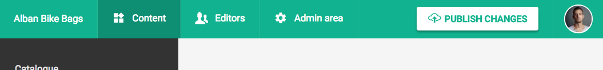

Once you have your deployment set up, in the top navigation bar of the interface of DatoCMS you will find a _Publish changes_ button: your editors will be able to request a new publication of the static website whenever they like.

The job of building and deploying your static website is not performed directly by DatoCMS, but is delegated to an external Continuous Deployment service. We offer integrations to all the most popular solutions out there (most of them have a free plan available):

- [Netlify](/docs/deployments/netlify/)
- [Travis CI](/docs/deployments/travis/)
- [Gitlab CI](/docs/deployments/gitlab/)
- [CircleCI](/docs/deployments/circleci/)

If you need to use some other CI tool, we also offer an [agnostic webhook](/docs/deployments/custom-webhook/) you can use to connect DatoCMS to your custom deployment solution.

Regardless the external service you intend to use, your CI build script needs to perform three steps:

1. Run the `dato dump` command to fetch the DatoCMS content and transform it into local files;
1. Run the build command of your static website generator to produce the actual static website (ie. `jekyll build` for Jekyll);
1. Upload the files of your static website to S3, Surge.sh or any other hosting solution you intend to use.

In the following chapters we'll deep dive into each different service to see how to properly configure them.
