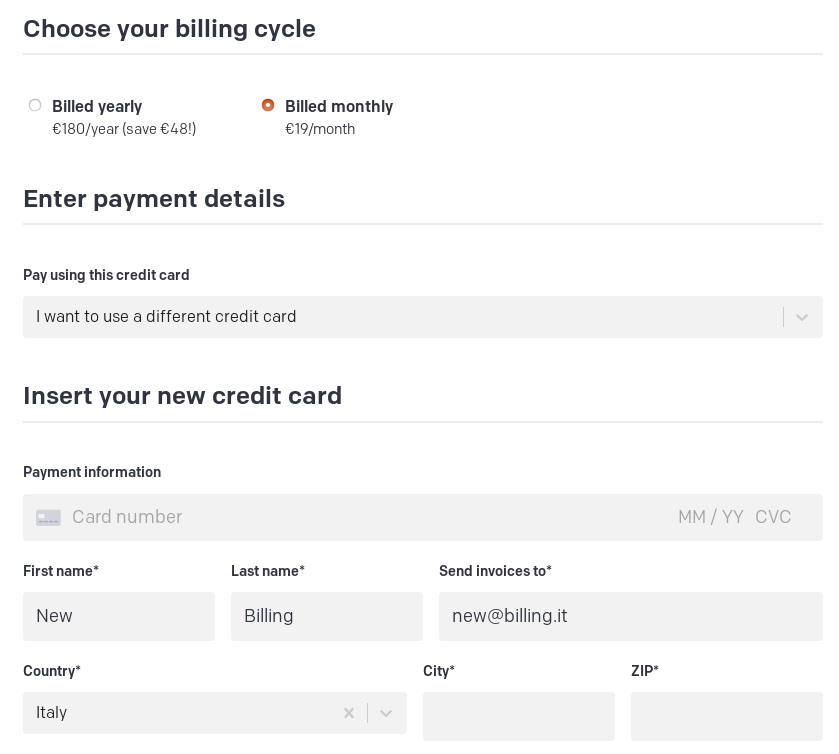
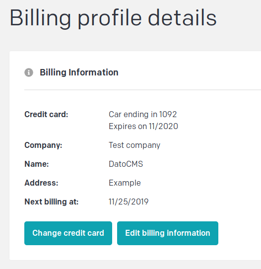
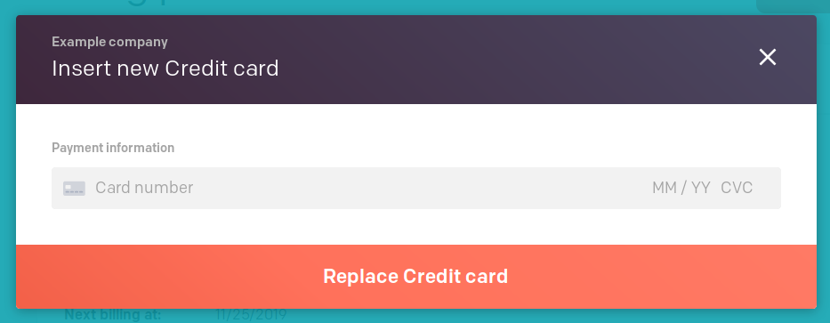

### Free and paid plans

All projects on DatoCMS start from the free plan and can be upgraded to a paid plan directly from the [Account dashboard](https://dashboard.datocms.com).

The differences between the various plans, including the features and all the available resources, are listed in detail in the [pricing page](/pricing).

Every DatoCMS account can have multiple billing profiles — that is, credit cards plus billing information — and you can decide what billing profile to use on a per-project basic. More than one project can be linked to the same billing profile. If you have more than a project on the same billing profile, a single, cumulative monthly/yearly invoice will be generated.

Paid plans usage limits, features and resources may change in the future, but you will remain on the one you choose unless you decide to switch to a newer plan yourself. Free plan usage limits and resources may change unilaterally instead. 

### Billing and payments

When you enroll in a monthly plan, you are billed for the first month up-front and then again on the same date each month moving forward until you cancel. When you enroll in an annual plan, you are billed for the first year up-front and then again on the same date each year moving forward until you cancel.

The projects in the monthly plans follow the day of completion of the billing profile. You can view them from your dashboard. Projects are invoiced and charged along with any overage accrued during the previous month.

Projects in monthly plans follow calendar months, are invoiced and charged along with any overage accrued during the previous month.

In the case of payment failures, we will notify you by email, and retry the payment 3 times. If payment still has not gone through, and we have not been able to contact you, the project will be temporarily deactivated until you provide a new credit card.

### Changing plans

Plan changes can be performed at any time, and take effect immediately.

We prorate the price when you change plans so you are only billed for the cost of the new plan less the remaining unused amount from your current plan. 

In case of a downgrade, prorated credits will be created, with a part used to pay the new invoice and the remaining credit balance will be available for future use.

### Overcharges on API and bandwidth usage

All Plans include the following monthly usage limits:

| Metric          | Free    | Basic   | Plus    | Max       |
| --------------- | ------- | ------- | ------- | --------- |
| Total API calls | 50,000  | 100,000 | 300,000 | 1,000,000 |
| Bandwidth       | 10GB    | 200GB   | 1TB     | 2TB       |

These are our definitions of the two metrics examined:

- **API Calls**: The number of requests made to both our Content Management and Content Delivery APIs. 
- **Bandwidth**: Amount of asset data transferred between our Asset CDN and GraphQL Content Delivery API and content consumers.

DatoCMS measures API calls and bandwidth usage in real time, and it is possible to check the day-by-day consumption from the project dashboard.

When they reach a usage limit on a free plan project, service will be temporarily disabled until the beginning of the following calendar month, unless you provide a credit card.

For projects inside a paid plan, exceeding the limits does not lead to the interruption of the service, but the payment of an additional fee commensurate with the use.

The current overage rates are as follows:

- **API calls**: €9 per additional 250k operations
- **Bandwidth**: €29 per additional 150GB bandwidth

The amount will be charged to the credit card associated with the billing profile on the next monthly/yearly invoice.

Changing plan increases and decreases the monthly limits of DatoCMS in real-time.

### Cancelations and Refunds

You may cancel at any time during your billing cycle for free. Any overage will be tallied and charged at the next renewal date, unless the billing profile is deleted, in which case overage is tallied and charged immediately.

To switch from a paid plan to a free plan you can either delete the site you're paying for, or reduce site's usage below the free plan limits.

You can request a refund of an annual plan within 15 days of purchase. Refunds are issued to the card that was originally charged, and may take up to 10 business days to complete.

### Multiple billing profiles

For each account you can have multiple billing accounts registered. Each billing profile will have its own billing cycle working as we explained [above](#billing-and-payments).

You can add a new billing profile just before finalising the payment:

### Change credit card

If your card expires, or for whatever other reason you need to change the credit card attached to your billing profile, go to your billing profile page:

and there click on the "Change credit card" button.

By doing this you don't need to transfer your project to a separate billing account, nor you will need to start a new billing cycle. This will simply start charging a different card and keep everything else unchanged.
