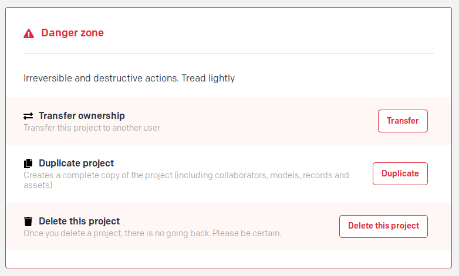
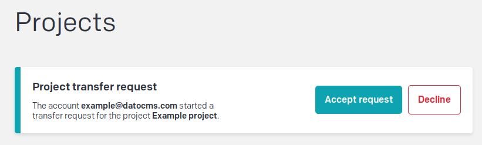
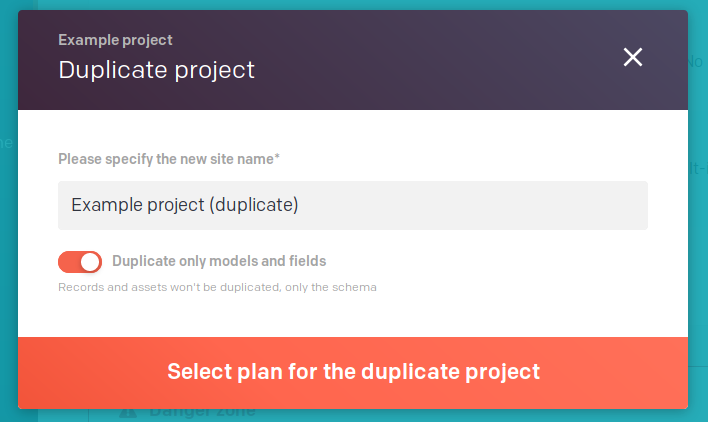

Let's have a look at the _Danger zone_ that you'll find at the bottom of the project description in your dashboard if you are the project owner:

### Transfer project

Transferring a project is useful when you want to start a new billing cycle under a different account. In this case you can go ahead and click "Transfer".

This will let you input the email address of the destination account.

Conversely, the receiving account will receive an email and find a popup at the top of their dashboard:

If the project needs a billing account, on accepting the project you'll be prompted to pick the plan and the billing profile to attach to it.

If the former owner had paid for any unused credit it will show in their billing profile and will be used automatically on any new invoice. 

**Credit cannot be transferred from one billing profile to another.**

### Duplicate project

When duplicating a project you'll be asked if you want to duplicate the schema only or also the data by using this toggle:

### Delete project

When deleting the project we immediately delete all your content from our database. We have a small window of time in which we can retrieve backups, but after that all is gone, so be careful.
