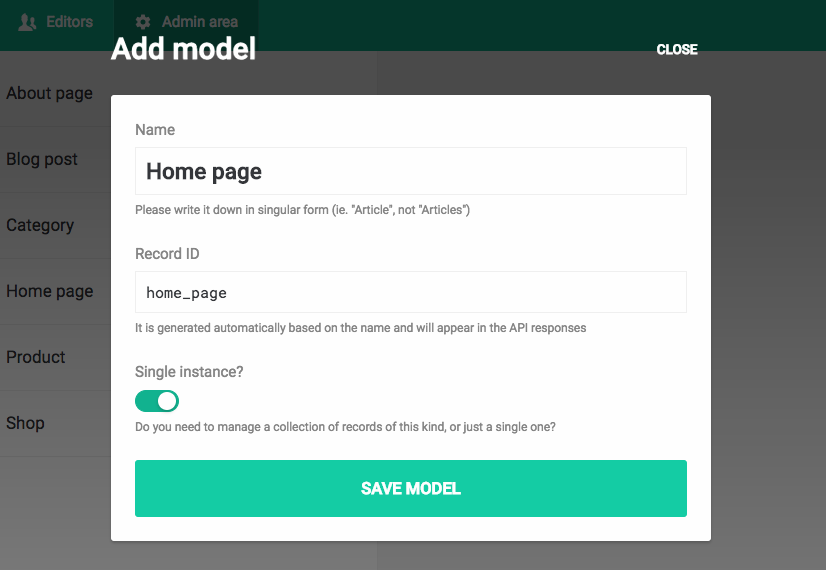

Real-world websites have often pages which don't resemble any other (eg. the *About us* page, or even the homepage). 

If you want to allow the editors to change their content, you can create a <strong>Single-instance</strong> model: 

While *collection* models enable the creation of multiple records, *single-instance* models allow just a single item to be edited in the administrative area.

