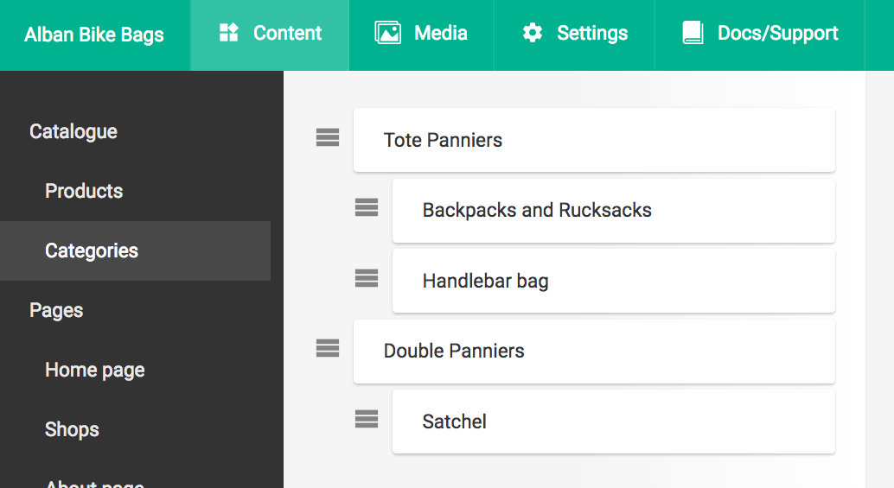
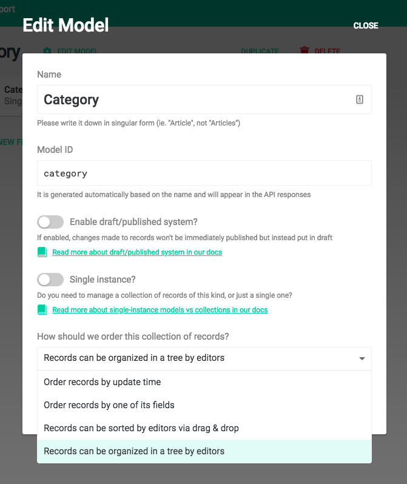

Taxonomies, product categories, navigation bars... websites are full of
hierarchical data. DatoCMS is the only headless CMS that supports tree-like
data structures out-of-the-box, offering a delightful editing experience
for your editors and marketers.

If you want to arrange a Model collection as a Tree, you need to select the *Records can be organized in a tree by editors*:

