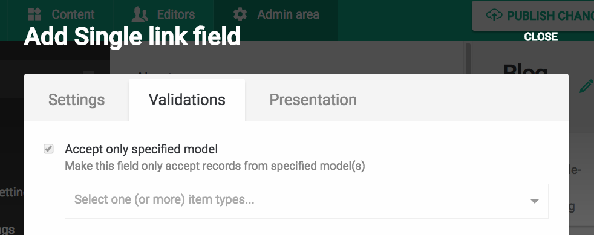
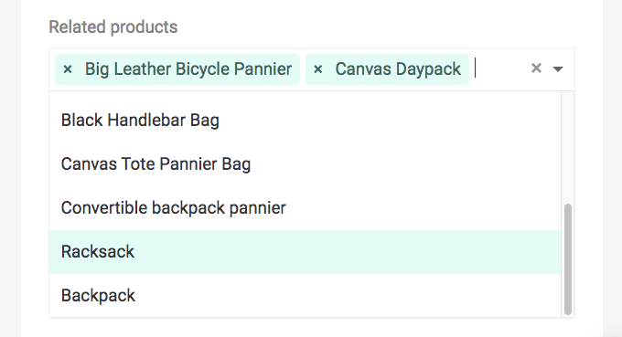
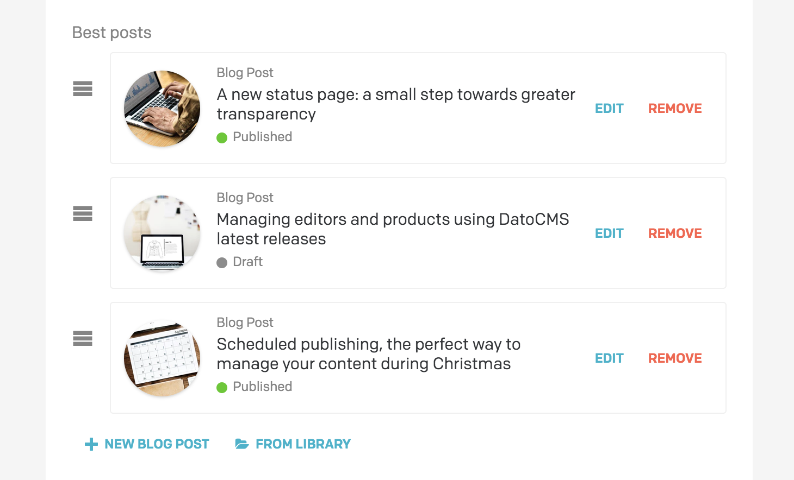
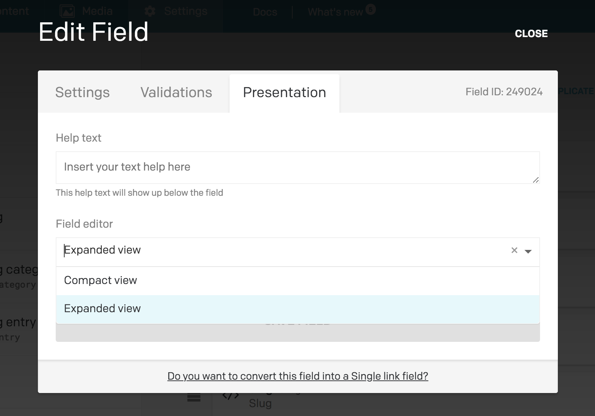

Links are a powerful way to model relationships between content. Models can have link fields which point to other records, for example:

* An article linking to its category (singular relationship).
* An article linking to some related articles (plural relationship).

In DatoCMS you don't need to define a field for the reverse relationship (ie. the category linking to its articles): as we'll discover later during the integration with your static website, you can easily perform reverse reference lookups in a couple of lines of code.

When you add a new field of type **Link** (or **Links**) to a model, DatoCMS requires you to specify, within the *Validations* tab, the models that can be referenced in the field itself:

To let the editors select one (or more) records to link, DatoCMS will present a dropdown with auto-completion turned on:

### Expanded view

If you prefer, you can switch any field to **Expanded view** mode, to allow your editors to have a nicer, more meaningful preview of the linked records:

As with any other fields, this setting is under the *Presentation* tab of your field:

