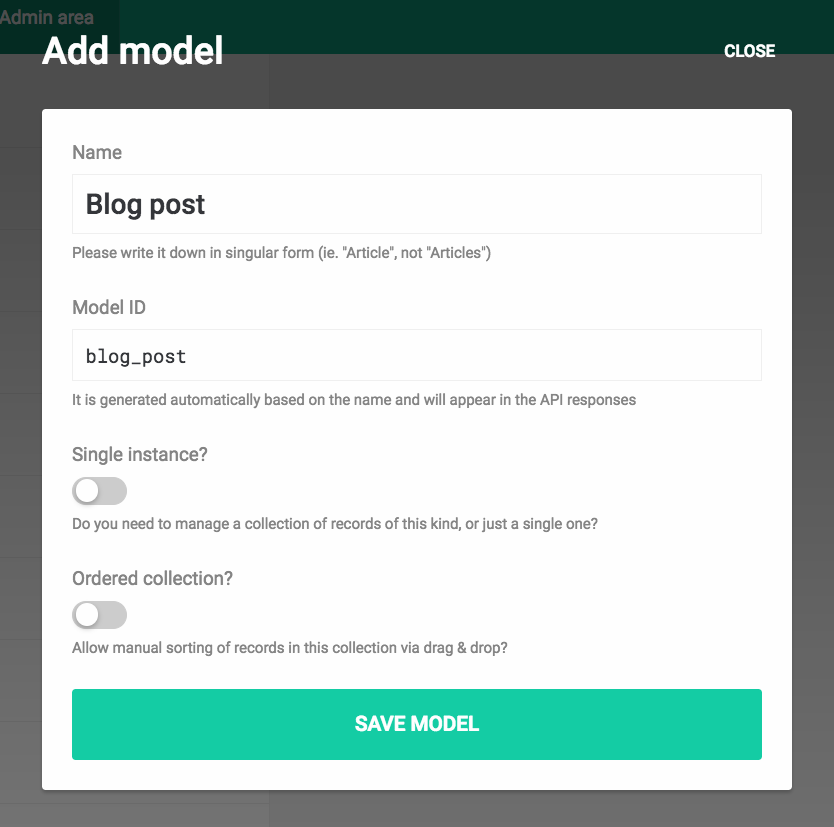
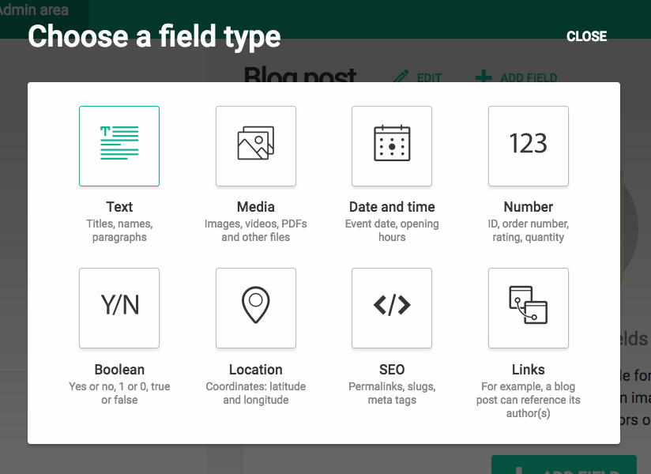
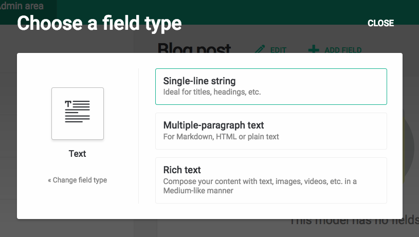
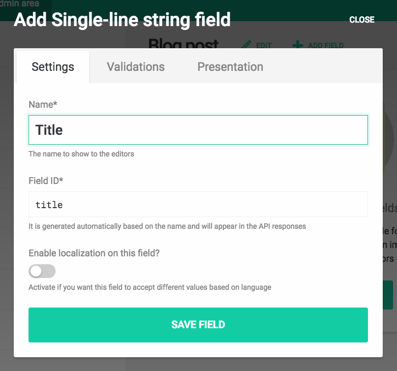
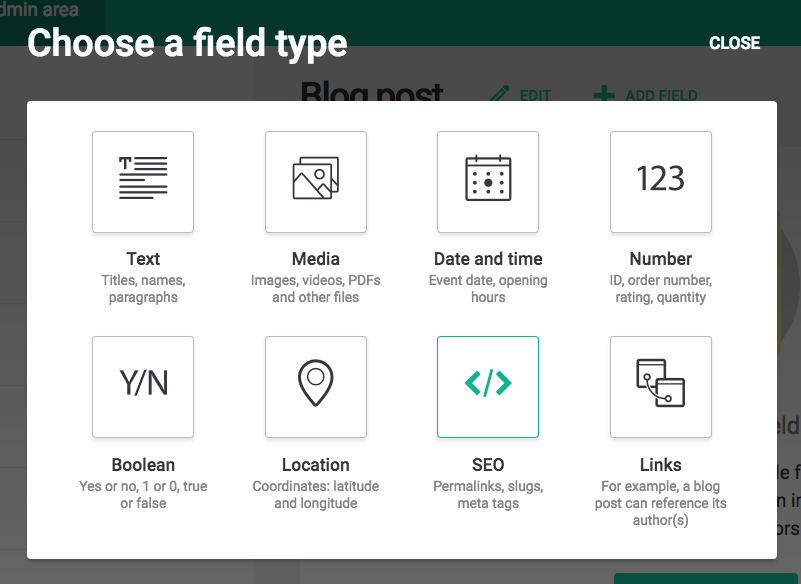
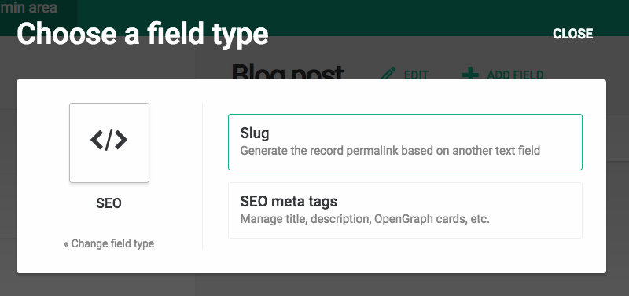
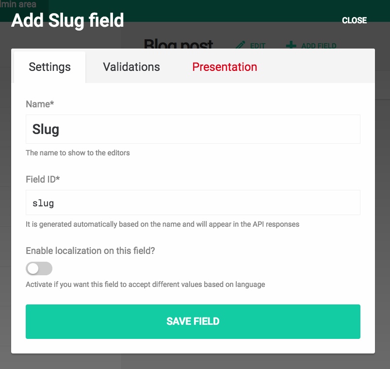
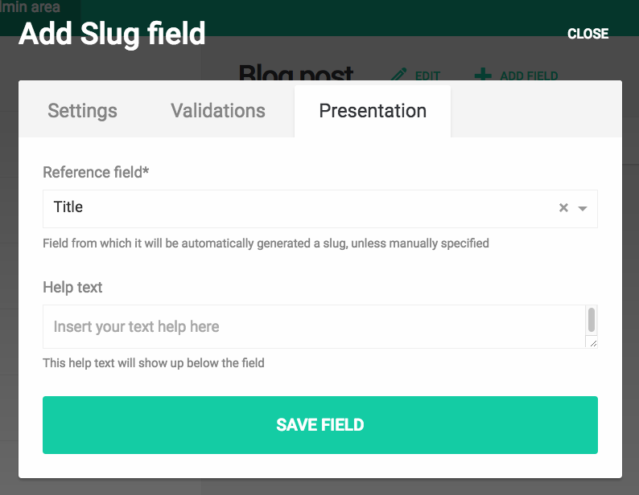

In DatoCMS you can add to your models a special field type called *Slug* to let your editors specify the URL permalink of a record. 

A slug field is linked to another *single-line string* field of the same model, usually the title. As soon as the editor begins to type the title, the slug field will be filled with an URL-friendly version of the same string:

The nice thing about slug fields is that, if the editor subsequently updates the record's title, the slug won't change, preserving all the SEO benefits.

---

### How to add a slug field to a model

Within the *Admin area > Item types* section, create a new "Blog post" model:

Then add a Title field:

Now you can add a Slug field (you can find it under the *SEO* group):

Make sure, under the *Presentation* tab, to select the title field as its reference:

