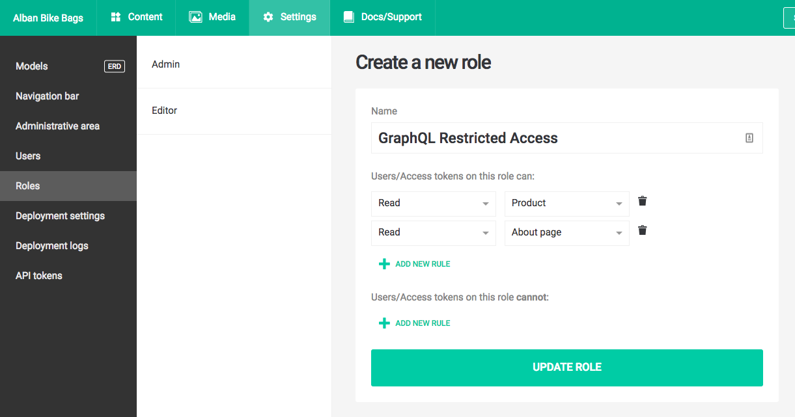
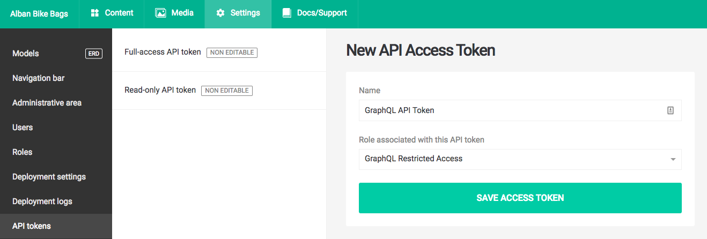

To communicate with the GraphQL server, you'll need an API token. To start, you can find your read-only API token in the *Settings > API tokens* section of your administrative area:

#### Restricting access

If you want to restrict GraphQL access only to a selection of your DatoCMS models, you can generate a custom API token. To do that, first go to *Settings > Roles* and create a new role, specifying the models to whitelist:

You can then create a new API token associating it with the role you just created:

