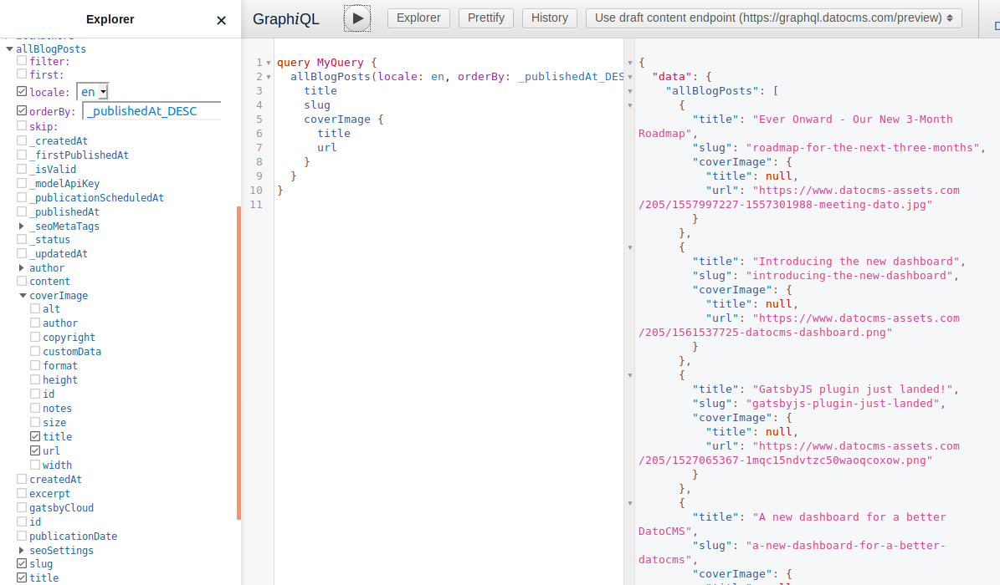

To see what queries are available in your schema you can use our [GraphiQL Query Explorer](https://cda-explorer.datocms.com/). 

Type your GraphQL query in the left-most text box and then press Play button:

<iframe src="https://cda-explorer.datocms.com/?embed&apitoken=faeb9172e232a75339242faafb9e56de8c8f13b735f7090964&query=%7B%0A%20%20allBlogPosts(orderBy%3A%5BpublicationDate_DESC%5D%2C%20first%3A%203)%20%7B%0A%20%20%20%20title%0A%20%20%20%20author%20%7B%0A%20%20%20%20%20%20name%0A%20%20%20%20%7D%0A%20%20%20%20publicationDate%0A%20%20%7D%0A%7D%0A"></iframe>

You can explore and auto-fill your queries using the explorer on the left, in the [GraphiQL Query Explorer](https://cda-explorer.datocms.com/), like so:

