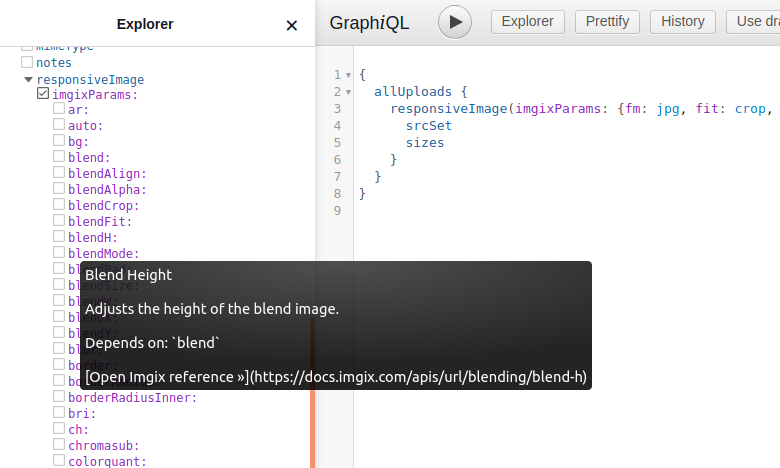
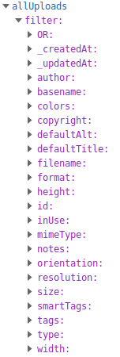

All the assets are augmented with some extra fields exposed via the
GraphQL API, to allow you some extra possibilities on the frontend.

### Images

Besides all the fields that you can explore via the CMS interface, the API returns
the [blurhash](https://blurha.sh/) of every image, also as a base64-encoded image.
You can embed that directly in the HTML of the page and then swap it with the
actual image at a later time, to offer a smooth experience when loading images (LQIP).

Alternatively a more minimal option is to use the dominant colors to prepare the space
where the image will be shown:

<iframe src="https://cda-explorer.datocms.com/?embed=&apitoken=faeb9172e232a75339242faafb9e56de8c8f13b735f7090964&query=%7B%0A%20%20allUploads%20%7B%0A%20%20%20%20blurhash%0A%20%20%20%20blurUpThumb%0A%20%20%20%20colors%20%7B%20hex%20%7D%0A%20%20%7D%0A%7D%0A"></iframe>

### Responsive images

One special augmentation that we offer on top of images in our GraphQL API is the `responsiveImage`
object.

In this object you can find pre-computed image attributes that will help you setting up responsive
images in your frontend without any additional manipulation.

We support as arguments all the [Imgix parameters](https://docs.imgix.com/apis/url) and also the HTML5
`img` sizes, to send media queries for extra control, that we simply forward:

<iframe src="https://cda-explorer.datocms.com/?embed=&apitoken=faeb9172e232a75339242faafb9e56de8c8f13b735f7090964&query=%7B%0A%20%20allUploads%20%7B%0A%20%20%20%20responsiveImage%28imgixParams%3A%20%7Bfm%3A%20jpg%2C%20fit%3A%20crop%2C%20w%3A%20600%2C%20h%3A%20600%7D%2C%20sizes%3A%20%22%28max-width%3A%20600px%29%20100vw%2C%20600px%22%29%20%7B%0A%20%20%20%20%20%20srcSet%20%20%20%20%20%20%20%20%20%20%20%20%20%23%20%3C-%20HTML5%20src%2Fsrcset%2Fsizes%20attributes%0A%20%20%20%20%09webpSrcSet%20%20%20%20%20%20%20%20%20%23%0A%20%20%20%20%20%20sizes%20%20%20%20%20%20%20%20%20%20%20%20%20%20%23%0A%20%20%20%20%20%20src%20%20%20%20%20%20%20%20%20%20%20%20%20%20%20%20%23%0A%20%20%20%20%20%20%0A%20%20%20%20%20%20width%20%20%20%20%20%20%20%20%20%20%20%20%20%20%23%20%3C-%20size%20information%0A%20%20%20%20%20%20height%20%20%20%20%20%20%20%20%20%20%20%20%20%23%0A%20%20%20%20%20%20aspectRatio%20%20%20%20%20%20%20%20%23%0A%0A%20%20%20%20%20%20alt%20%20%20%20%20%20%20%20%20%20%20%20%20%20%20%20%23%20%3C-%20SEO%20attributes%0A%20%20%20%20%20%20title%20%20%20%20%20%20%20%20%20%20%20%20%20%20%23%0A%0A%20%20%20%20%20%20bgColor%20%20%20%20%20%20%20%20%20%20%20%20%23%20%3C-%20background%20color%20placeholder%0A%0A%20%20%20%20%20%20base64%20%20%20%20%20%20%20%20%20%20%20%20%20%23%20%3C-%20blur-up%20placeholder%2C%20base64-encoded%20JPEG%0A%20%20%20%20%7D%0A%20%20%7D%0A%7D%0A"></iframe>

One particularly handy feature of the GraphiQL explorer is that you can explore all the Imgix parameters
and read the documentation on the fly by hovering on the parameters or searching for them in the docs pane:

To read all the details of the `responsiveImage` object head to [the blog post](https://www.datocms.com/blog/offer-responsive-progressive-lqip-images-in-2020/#putting-it-all-together-introducing-the-responsiveimage-query)
where you can also find some examples and integrations.

### Videos

If you chose to upload videos on DatoCMS, thanks to the integration with [Mux](https://www.mux.com),
we can augment the video objects with:

- HSL video streaming URL;
- high, medium and low quality MP4 versions of the video to support legacy browsers that do not support HSL;
- duration and frame rate of the video;
- thumbnail URL: resizable, croppable and available in JPEG, PNG and GIF format.

Like so:

<iframe src="https://cda-explorer.datocms.com/?embed=&apitoken=faeb9172e232a75339242faafb9e56de8c8f13b735f7090964&query=%7B%0A%20%20allUploads%28filter%3A%20%7Btype%3A%20%7Beq%3A%20video%7D%2C%20resolution%3A%20%7B%7D%2C%20smartTags%3A%20%7B%7D%7D%29%20%7B%0A%20%20%20%20video%20%7B%0A%20%20%20%20%20%20streamingUrl%0A%20%20%20%20%20%20mp4High%3A%20mp4Url%28res%3A%20high%29%0A%20%20%20%20%20%20mp4Med%3A%20mp4Url%28res%3A%20medium%29%0A%20%20%20%20%20%20mp4Low%3A%20mp4Url%28res%3A%20low%29%0A%20%20%20%20%20%20duration%0A%20%20%20%20%20%20framerate%0A%20%20%20%20%20%20thumbJpg%3A%20thumbnailUrl%28format%3A%20jpg%29%0A%20%20%20%20%20%20thumbPng%3A%20thumbnailUrl%28format%3A%20png%29%0A%20%20%20%20%20%20thumbGif%3A%20thumbnailUrl%28format%3A%20gif%29%0A%20%20%20%20%7D%0A%20%20%7D%0A%7D%0A"></iframe>

### Filtering

You can filter on all the meaningful fields that we offer in the uploads.

Here's an example of what you'll see in your CDA explorer:

### Fetch uploads straight from the context

For the GraphQL veterans this will be obvious, but still we are impressed how cool it is to be able to fetch all the augmented assets directly from the context where they are used.

We hope you appreciate, as we do, something like this:

<iframe src="https://cda-explorer.datocms.com/?embed=&apitoken=faeb9172e232a75339242faafb9e56de8c8f13b735f7090964&query=%7B%0A%20%20allBlogPosts%20%7B%0A%20%20%20%20title%0A%20%20%20%20author%20%7B%0A%20%20%20%20%20%20name%0A%20%20%20%20%20%20avatar%20%7B%0A%20%20%20%20%20%20%20%20responsiveImage%20%7B%0A%20%20%20%20%20%20%20%20%20%20base64%0A%20%20%20%20%20%20%20%20%20%20sizes%0A%20%20%20%20%20%20%20%20%20%20srcSet%0A%20%20%20%20%20%20%20%20%20%20alt%0A%20%20%20%20%20%20%20%20%20%20title%0A%20%20%20%20%20%20%20%20%7D%0A%20%20%20%20%20%20%7D%0A%20%20%20%20%7D%0A%20%20%20%20content%20%7B%0A%20%20%20%20%20%20...%20on%20TextRecord%20%7B%0A%20%20%20%20%20%20%20%20text%28markdown%3A%20true%29%0A%20%20%20%20%20%20%7D%0A%20%20%20%20%20%20...%20on%20ImageRecord%20%7B%0A%20%20%20%20%20%20%20%20image%20%7B%0A%20%20%20%20%20%20%20%20%20%20responsiveImage%20%7B%0A%20%20%20%20%20%20%20%20%20%20%20%20base64%0A%20%20%20%20%20%20%20%20%20%20%20%20sizes%0A%20%20%20%20%20%20%20%20%20%20%20%20srcSet%0A%20%20%20%20%20%20%20%20%20%20%20%20alt%0A%20%20%20%20%20%20%20%20%20%20%20%20title%0A%20%20%20%20%20%20%20%20%20%20%7D%0A%20%20%20%20%20%20%20%20%7D%0A%20%20%20%20%20%20%7D%0A%20%20%20%20%20%20...%20on%20InternalVideoRecord%20%7B%0A%20%20%20%20%20%20%20%20video%20%7B%0A%20%20%20%20%20%20%20%20%20%20video%20%7B%0A%20%20%20%20%20%20%20%20%20%20%20%20streamingUrl%0A%20%20%20%20%20%20%20%20%20%20%20%20thumbnailUrl%28format%3A%20jpg%29%0A%20%20%20%20%20%20%20%20%20%20%20%20mp4Url%0A%20%20%20%20%20%20%20%20%20%20%7D%0A%20%20%20%20%20%20%20%20%7D%0A%20%20%20%20%20%20%7D%0A%20%20%20%20%7D%0A%20%20%7D%0A%7D%0A"></iframe>
