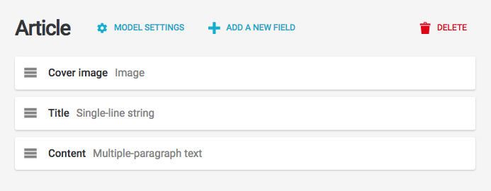
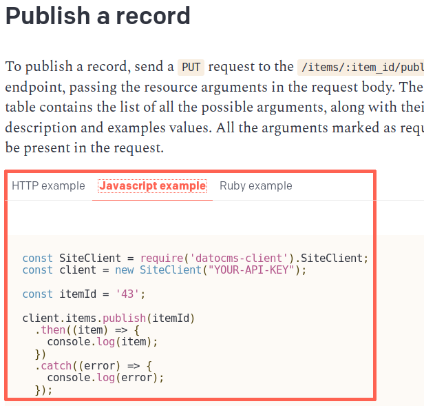

We released an NPM package to make it easy to programmatically read/create/edit/destroy any kind of resource a DatoCMS project might contain. Install the `datocms-client` package in your application:

```
$ npm install --save-dev datocms-client
```

Or, if you're using Yarn as package manager:

```
$ yarn add datocms-client
```

**Warning:** due to historical reasons and backward compatibility, the API exposes some different naming compared to the rest of the product: Models are called Item Types, while Records are called Items. Keep that in mind!

The first step is to require the DatoCMS package, and initialize the client with the read-write API token you can find under the *Admin area > API tokens* section. Let's create an `import.js` file with the following content:

```js
const SiteClient = require('datocms-client').SiteClient;

const client = new SiteClient('YOUR_API_READWRITE_TOKEN');
```

Now, suppose we have an administrative area with an *Article* model, and we want to import a list of articles ie. from a JSON file:



The first thing to know is the ID of the model itself. Let's add the following line to pretty print the existing models:

```js
const SiteClient = require('datocms-client').SiteClient;

const client = new SiteClient('YOUR_API_READWRITE_TOKEN');

client.itemTypes.all()
  .then((models) => console.log(models));
```

As you can see `client.itemTypes.all()` method returns a promise. Here's the output when we execute the script:

```
$ node import.js
[ 
  { 
    id: '7149',
    name: 'Article',
    singleton: false,
    sortable: false,
    apiKey: 'article',
    fields: [ '27669', '27667', '27668' ] 
  }
]
```

We can also inspect the fields contained in the model:

```js
// obtain all the fields of the model
client.fields.all("7149")
  .then((fields) => console.log(fields));

// Output:
//
// [ { id: '27667',
//     label: 'Title',
//     fieldType: 'string',
//     apiKey: 'title',
//     hint: null,
//     localized: false,
//     validators: {},
//     position: 2,
//     appeareance: { type: 'title' },
//     itemType: '7149' },
//   { id: '27668',
//     label: 'Content',
//     fieldType: 'text',
//     apiKey: 'content',
//     hint: null,
//     localized: false,
//     validators: {},
//     position: 3,
//     appeareance: { type: 'wysiwyg' },
//     itemType: '7149' },
//   { id: '27669',
//     label: 'Cover image',
//     fieldType: 'image',
//     apiKey: 'cover_image',
//     hint: null,
//     localized: false,
//     validators: {},
//     position: 1,
//     appeareance: {},
//     itemType: '7149' } ] ]
```

Great, here there are our three fields. Let's create our article:

```js
// create a new Article record
client.uploadFile('http://i.giphy.com/NXOF5rlaSXdAc.gif')
  .then((image) => {
    return client.items.create({
      itemType: '7149',
      title: 'My first article!',
      content: 'Lorem ipsum dolor sit amet, consectetur adipisicing elit, sed eiusmod.',
      coverImage: image
    })
  })
  .then(record => console.log(record));

// Output:
// { id: '43858',
//   updatedAt: '2017-03-20T14:34:30.249Z',
//   isValid: true,
//   title: 'My first article!',
//   content: 'Lorem ipsum dolor sit amet, consectetur adipisicing elit, sed eiusmod.',
//   coverImage: '1834832',
//   itemType: '7149' }
```

As you can see, we use the helper method `client.uploadFile` to pass DatoCMS the metadata of the image to associate to the record.

## Retrieving records

To retrieve the stored records:

```js
client.items.all({}, { allPages: true })
  .then((records) => console.log(records));
```

If you want to retrieve just the records of a specific model (ie. `article`):

```js
client.items.all({ 'filter[type]': 'article' }, { allPages: true })
  .then((records) => console.log(records));
```

You can also pass the model ID instead of the model API identifier.

## Linking records

If you have a record with some a link field (ie. an article linked to its category), during the creation you need to pass the ID of the linked record:

```js
client.items.create({
  itemType: '7150',
  name: 'My category',
})
  .then((category) => {
    return client.items.create({
      itemType: '7149',
      title: 'My first article!',
      content: 'Lorem ipsum dolor sit amet, consectetur adipisicing elit, sed eiusmod.',
      category: category.id,
    });
  })
  .then((record) => console.log(record));
```

If you have a "multiple links" field, then you need to pass the array of IDs:

```js
client.items.create({
  itemType: '7150',
  name: 'My category',
})
  .then((category) => {
    return client.items.create({
      itemType: '7149',
      title: 'My first article!',
      content: 'Lorem ipsum dolor sit amet, consectetur adipisicing elit, sed eiusmod.',
      categories: [category.id]
    });
  })
  .then((record) => console.log(record));
```

## Multi-language fields

If localization is enabled on some field, the format of the payload changes a little bit, as you need to pass an hash representing the value of the field for each of the locales you setup in your administrative area:

```js
// create a new Article record
client.uploadImage('http://i.giphy.com/NXOF5rlaSXdAc.gif')
  .then((image) => {
    return client.items.create({
      itemType: '7149',
      title: {
        en: 'My first article!',
        it: 'Il mio primo articolo!'
      },
      content: 'Lorem ipsum dolor sit amet, consectetur adipisicing elit, sed eiusmod.',
      coverImage: image
    })
  })
  .then(record => console.log(record));
```

## Further documentation

Every API call that you can do with the JavaScript client is documented in the following sections of the guide.

You'll find an example for every section, like this:

