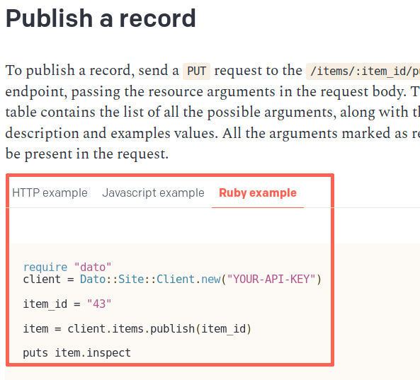

We released a Ruby gem to make it easy to programmatically read/create/edit/destroy any kind of resource a DatoCMS project might contain. Add this line to your application's `Gemfile` and then install the gem running `bundle install` within your terminal:

```ruby
gem "dato"
```

The first step is to require the DatoCMS gem, and initialize the client with the read-write API token you can find under the *Admin area > API tokens* section. Let's create an `import.rb` file with the following content:

```ruby
require "dato"

# create a DatoCMS client
client = Dato::Site::Client.new("YOUR_API_READWRITE_TOKEN")
```

Now, suppose we have an administrative area with an *Article* model, and we want to import a list of articles ie. from a JSON file:


The first thing to know is the ID of the model itself. Let's add the following line to pretty print the existing models:

```ruby
require "dato"
require "pp"

# create a DatoCMS client
client = Dato::Site::Client.new("YOUR_API_READWRITE_TOKEN")

# inspect the list of models
pp client.item_types.all
```

Due to historical reasons and backward compatibility, the API exposes some different naming compared to the rest of the product: Models are called Item Types, while Records are called Items. Keep that in mind! Executing the script the following output appears:

```
$ ruby import.rb
[
  {
    "id"             => "7149",
    "name"           => "Article",
    "singleton"      => false,
    "sortable"       => false,
    "api_key"        => "article",
    "fields"         => ["27669", "27667", "27668"],
    "singleton_item" => nil
  }
]
```

We can also inspect the fields contained in the model:

```
# obtain all the fields of the model
pp client.fields.all("7149")

# Output:
#
# [
#   {
#     "id"          => "27667",
#     "label"       => "Title",
#     "field_type"  => "string",
#     "api_key"     => "title",
#     "hint"        => nil,
#     "localized"   => false,
#     "validators"  => {},
#     "position"    => 2,
#     "appeareance" => {"type"=>"title"},
#     "item_type"   => "7149"
#   },
#   {
#     "id"          => "27668",
#     "label"       => "Content",
#     "field_type"  => "text",
#     "api_key"     => "content",
#     "hint"        => nil,
#     "localized"   => false,
#     "validators"  => {},
#     "position"    => 3,
#     "appeareance" => {"type"=>"wysiwyg"},
#     "item_type"   => "7149"
#   },
#   {
#     "id"          => "27669",
#     "label"       => "Cover image",
#     "field_type"  => "image",
#     "api_key"     => "cover_image",
#     "hint"        => nil,
#     "localized"   => false,
#     "validators"  => {},
#     "position"    => 1,
#     "appeareance" => {},
#     "item_type"   => "7149"
#   }
# ]
```

Great, here there are our three fields. Let's create a new article:

```ruby
# create a new Article record
pp client.items.create(
  item_type: "7149",
  title: "My first article!",
  content: "Lorem ipsum dolor sit amet, consectetur adipisicing elit, sed eiusmod.",
  cover_image: client.upload_image("http://i.giphy.com/NXOF5rlaSXdAc.gif")
)

# Output:
# {
#  "id"          => "43846",
#  "updated_at"  => "2017-03-20T13:25:11.707Z",
#  "is_valid"    => true,
#  "title"       => "My first article!",
#  "content"     => "Lorem ipsum dolor sit amet, consectetur adipisicing elit, sed eiusmod.",
#  "cover_image" => "398402",
#  "item_type"   => "7149"
# }
```

As you can see, we use the helper method `client.upload_image` to pass DatoCMS the image to upload.

Note: ensure that the URL passed passed to `client.upload_image` is escaped correctly:

```ruby
require "uri"

escaped = URI.escape(url)
client.upload_image(escaped)
```

## Retrieving records

To retrieve the stored records:

```ruby
records = client.items.all({}, all_pages: true)
```

If you want to retrieve just the records of a specific model (ie. `article`):

```ruby
records = client.items.all({ "filter[type]" => "article" }, all_pages: true)
```

You can also pass the model ID instead of the model API identifier.

## Linking records

If you have a record with some a link field (ie. an article linked to its category), during the creation you need to pass the ID of the linked record:

```ruby
category = client.items.create(
  item_type: "7150"
  name: "My category"
)

article = client.items.create(
  item_type: "7149",
  title: "My first article!",
  content: "Lorem ipsum dolor sit amet, consectetur adipisicing elit, sed eiusmod.",
  category: category.id
)
```

If you have a "multiple links" field, then you need to pass the array of IDs:

```ruby
category = client.items.create(
  item_type: "7150"
  name: "My category"
)

article = client.items.create(
  item_type: "7149",
  title: "My first article!",
  content: "Lorem ipsum dolor sit amet, consectetur adipisicing elit, sed eiusmod.",
  categories: [category.id]
)
```

## Multi-language fields

If localization is enabled on some field, the format of the payload changes a little bit, as you need to pass an hash representing the value of the field for each of the locales you setup in your administrative area:

```ruby
# create a new Article record
pp client.items.create(
  item_type: "7149",
  title: {
    en: "My first article!",
    it: "Il mio primo articolo!"
  },
  content: "Lorem ipsum dolor sit amet, consectetur adipisicing elit, sed eiusmod.",
  cover_image: client.upload_image("http://i.giphy.com/NXOF5rlaSXdAc.gif")
)
```

## Further documentation

Every API call that you can do with the Ruby client is documented in the following sections of the guide.

You'll find an example for every section, like this:


