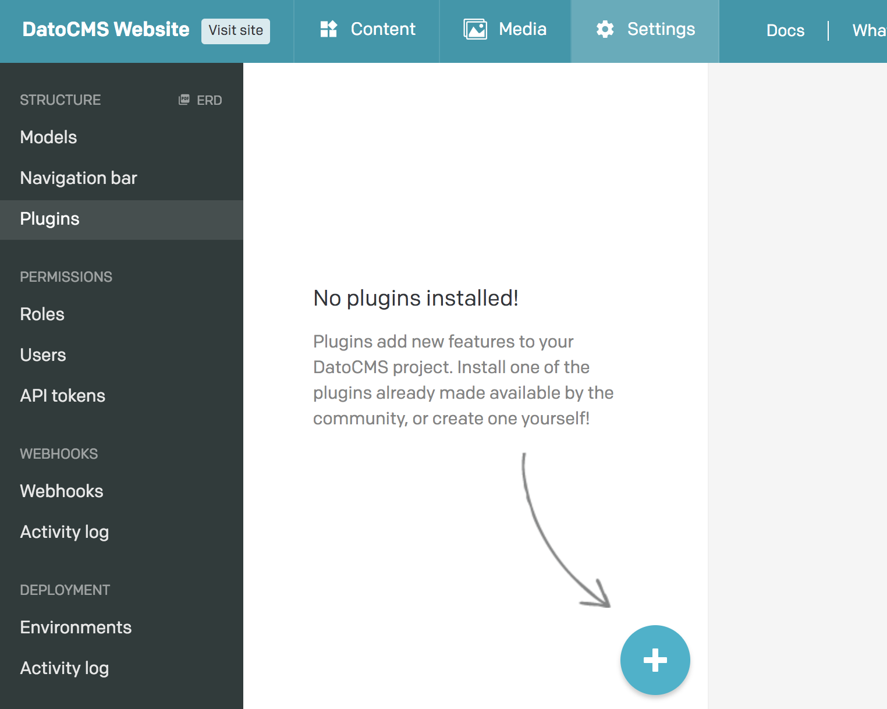
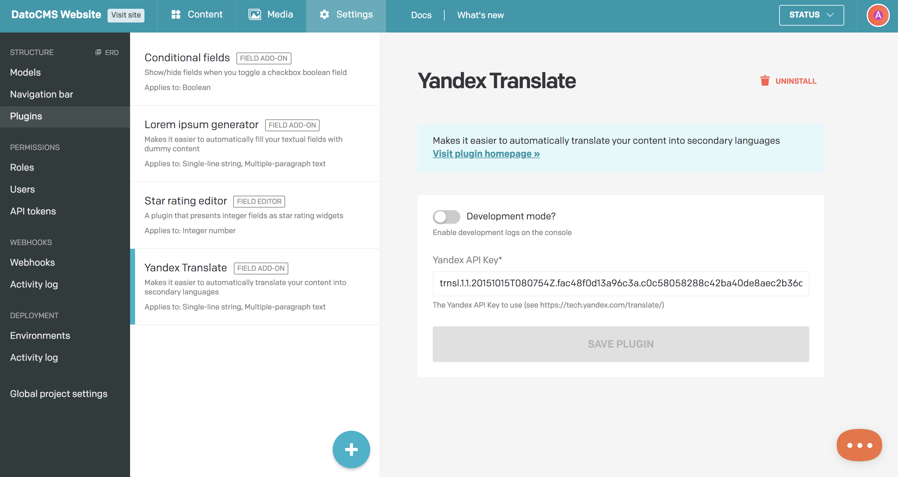
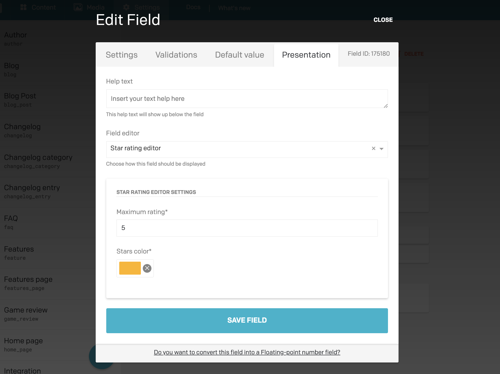
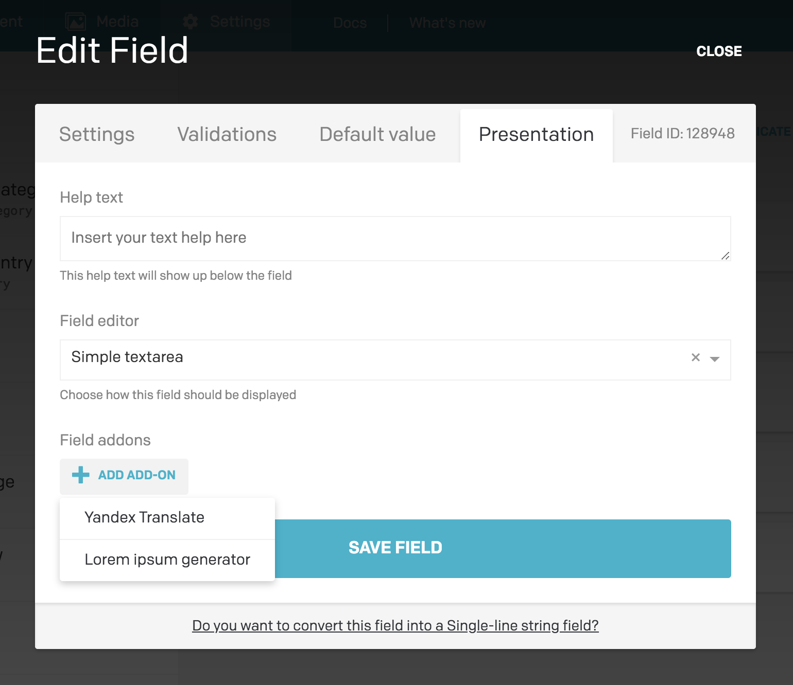

The community of DatoCMS users has released a number of different plugins. As we'll see later in much detail, they're basically NPM packages.

To install a new plugin to one of your projects, head over to the *Settings > Plugins* section of your administrative area, and press the plus button:

This will open up a modal where you will be able to search for plugins by keywords, tags and maintainer. From there you can click on the *Install* button to install a plugin to your project:

Once installed, depending on the plugin, you might need to specify some global settings:

### Assigning a plugin to a field

Once an plugin has been successfully installed, it can be assigned to one (or many) fields in one of your models. To do that navigate to a Model, select a field and navigate to the *Settings > Presentation* tab of the field.

If a plugin is a field editor or a sidebar widget — and the plugin is compatible with the type of field you've selected — you will be able to select it and setup any configuration options:

If the plugin is a field addon — and again, if the plugin is compatible with the type of field you've selected — you will be able to add it and configure it as well:

To use the plugin across several fields, just repeat the above steps again for each field.
