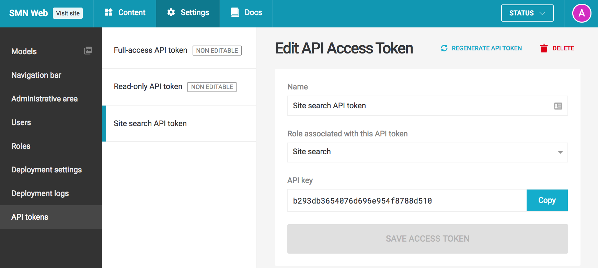

Once you've configured your DatoCMS administrative area, from your website, you can make AJAX requests to our JSON API to present relevant results to your visitors.

#### Obtaining an API token

To do that, first you need to generate an API token with the proper permissions. Go to *Settings > Roles* and create a new role with just the *Can perform Site Search API calls* option checked:


 
You can then create a new API token associating it with the role you just created:



Awesome! Let's test if everything is working by making a curl request to our API endpoint:

```bash
curl 'https://site-api.datocms.com/search-results?q=florence' \
  -H 'Authorization: API-Token YOUR_API_TOKEN_HERE' \
  -H 'Accept: application/json' \
  -I -X GET -s -S | head -n1
```

If the output is `HTTP/1.1 200 OK`, you're good to go!

---

### Performing searches

To make it easy to integrate DatoCMS Site Search with your website, we make available a small JS library called [`datocms-search`](https://github.com/datocms/datocms-search) that you can add at the bottom of your pages:

```html
<html>
  <head>
    ...
  </head>
  <body>
    ...

    <!-- at the end of your page insert the following line -->
    <script src="https://unpkg.com/datocms-search@0.1.5/dist/datocms-search.base.js"></script>
  </body>
</html>
```

The library does not need any external dependencies, and can also be used with Webpack/Browserify. It exposes a `DatoCmsSearch` class that you can use to retrieve search results:

```js
var client = new DatoCmsSearch("YOUR_API_TOKEN_HERE", "production");

client.search("florence")
  .then(function(response) {
    console.info(response.results);
    // [
    //   {
    //     title: "The Crucifix by Brunelleschi",
    //     body: "...Santa Maria Novella in <strong class=\"highlight\">Florence</strong>..."
    //     url: "http://www.smn.it/en/opere/5104-the-crucifix-by-brunelleschi/",
    //   },
    //   ...
    // ]
    console.info(response.total);
    // 42
  })
  .catch(function(error) {
    console.error(error);
  });
```

As you can see, possible matching text is already highlighted for you. You can change the surrounding HTML using the `highlightWith` option:

```js
client.search("florence", { highlightWith: '<span class="h"></span>' })
  .then(function(response) {
    console.info(response.results[0].body);
    // "...Santa Maria Novella in <span class="h">Florence</span>..."
  });
```

You can also paginate results with the `limit` and `offset` options:

```js
client.search("florence", { limit: 20, offset: 15 })
```

If you have a multi-language website, you can force to return only pages in a specific language with the `locale` option:

```js
client.search("florence", { locale: "it" })
```

If you have a multi-language website and you don't pass any value for `locale`, DatoCMS will try its best to return pertinent results inspecting the `Accept-Language` header of the request to find a matching language for the user visiting the page.
