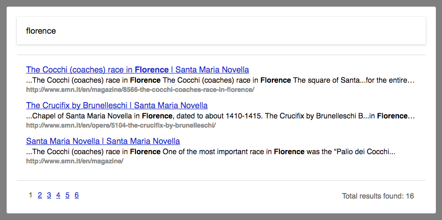

In addition to the [low-level API calls](/docs/search/integration) presented in the previous section, our [`datocms-search`](https://github.com/datocms/datocms-search) JS library also includes a full-featured widget ready to be used in your website:



To use it, add our JS and CSS in your page:

```html
<html>
  <head>
    ...
    <link rel="stylesheet" href="https://unpkg.com/datocms-search@0.1.5/styles/index.css" />
  </head>
  <body>
    ...

    <!-- at the end of your page insert the following line -->
    <script src="https://unpkg.com/datocms-search@0.1.5/dist/datocms-search.widget.js"></script>
  </body>
</html>
```

You can now call `client.addWidget()` specifying the CSS Selector where the widget will be inserted:

```html
<body>
  <div id="search-container"></div>

  <script src="https://unpkg.com/datocms-search@0.1.5/dist/datocms-search.widget.js"></script>

  <script>
    var client = new DatoCmsSearch("YOUR_API_TOKEN", "production");
    client.addWidget("#search-container");
  </script>
</body>
```

Of course, feel free to change the styling of the widget overriding our default CSS styles.

#### Language selection

If your site is multi-language, you can configure the widget to present them:

```js
var client = new DatoCmsSearch("YOUR_API_TOKEN", "production");
client.addWidget(
  "#search-container",
  {
    locales: [
      { label: "English", value: "en" },
      { label: "Italian", value: "it" },
    ]
  }
);
```

This will be the final result: 


#### Other options

The widget can be further customized with the following options:

```js
client.addWidget(
  "#search-container",
  {
    perPage: 10,              // specify the number of results per page
    initialQuery: "foobar",   // start the widget with this search
    initialLocale: "it",      // start the widget with this locale 
  }
);
```
