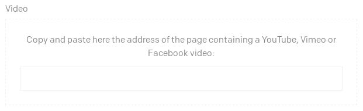

One of the fields that you can use in DatoCMS is the **video field**, that allows you to reference an external YouTube, Vimeo or Facebook video:

Which is nice because via OEmbed we'll fetch and store the thumbnail image, the title and the dimensions of the video. All information that you can then retrieve via the APIs.

But these information can only be fetched from public videos, so this does not apply to private videos with a scheduled publication date. This YouTube feature is very useful together with the [scheduled publication](/blog/scheduled-publishing-during-christmas) of DatoCMS's records.

But how can you make the two work together?

There's a little trick that you can use, it's not super handy but will do the job:

1. set the video to unlisted, unfortunately you cannot schedule an unlisted video to be listed
1. add the video to DatoCMS
1. set the video to private again and schedule the publication
1. schedule the publication of DatoCMS record together with the YouTube video

That's it! A bit hackish, but it's a way to work around the limitations of the system.