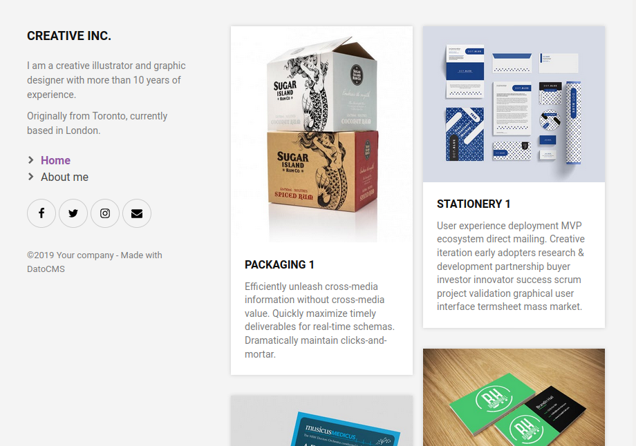
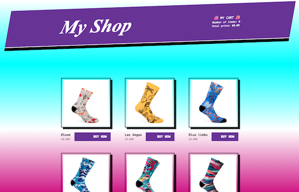

We have prepared two examples to get you started with Gatsby and DatoCMS, have a look at them!

### Portfolio

Have a look at our basic portfolio example, built with Gastby!

Check the [code on Github](https://github.com/datocms/gatsby-portfolio) and then you can set up the demo by clicking on the following button:

### Socks shop!

Integrating Gatsby, Snipcart and DatoCMS we've built a brutalist online shop for socks!

Check the [code on Github](https://github.com/datocms/snipcart-gatsby-demo) and then you can set up the demo by clicking on the following button:

