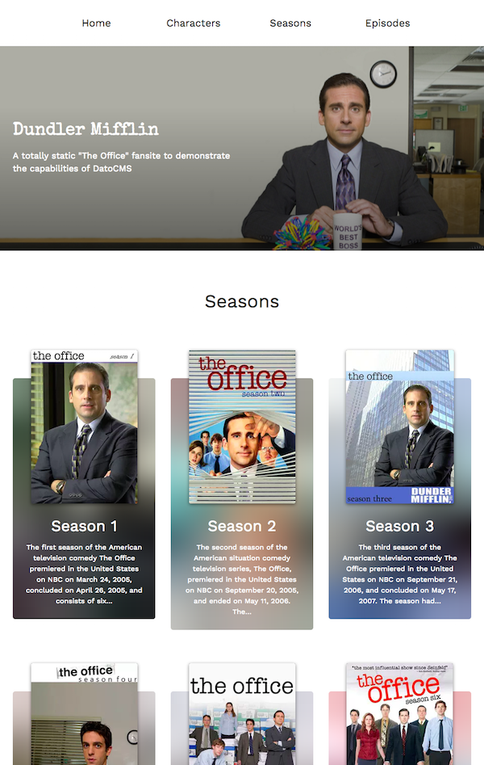

We have prepared two examples to get you started with Hugo and DatoCMS, have a look at them!

### Portfolio

Have a look at our basic portfolio example, built with Hugo!

Check the [code on Github](https://github.com/datocms/hugo-portfolio) and then you can set up the demo by clicking on the following button:

### Tribute site to The Office

We've built a tribute site to The Office :)

Check the [code on Github](https://github.com/datocms/hugo-example) and then you can set up the demo by clicking on the following button:

