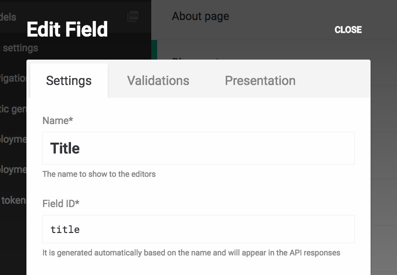
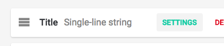

Once you have obtained a record object, you can access the value associated to a field using its *Field ID*:




In this case, the field ID is `title`, so we can use it as a method on the record object to retrieve its value.

```javascript
// dato.config.js

module.exports = (dato, root, i18n) => {
  const blogPost = dato.blogPosts[0];     // get the first blog post of the collection
  blogPost.title;                         // => "Hello world!"
}
```

**Important:** if the field ID contains underscores, remember to camel-case it (ie. a `featured_image` field ID becomes `featuredImage`).

Each record also exposes some additional methods you can use:

```js
blogPost.id               // returns the record ID:
                          // => "1242"

blogPost.itemType         // returns an object representing the model:
blogPost.itemType.id      // => "44"
blogPost.itemType.name    // => "Blog post"
blogPost.itemType.apiKey  // => "blog_post"

blogPost.updatedAt        // returns last modified date:
                          // => Fri Feb 10 2017 10:25:54 GMT+0100 (CET)

blogPost.position         // returns its ordinal number in the collection
                          // (only if the model is sortable or a tree):
                          //
                          // => 13

blogPost.parent           // returns the parent record (only if the model is a tree)
blogPost.children         // returns the children records (only if the model is a tree)

blogPost.toMap()          // returns an object containing the above, plus all the
                          // field's values:
                          //
                          // => {
                          //   id: "1242",
                          //   itemType: "blogPost",
                          //   updatedAt: "Fri Feb 10 2017 10:25:54 GMT+0100 (CET)",
                          //   title: "Hello world!",
                          //   ...
                          // }
```

Most field types return scalar values (integers, booleans, strings, etc.), but some other return more complex structures.

Keep in mind that the `.toMap()` method will limit the results to a maximum depth of 3. You can change this setting passing an explicit depth:

```
blogPost.toMap(10)   // this will go down 10 levels deep!
```

---

### File fields

*File* fields expose the following methods. The `.url()` method is the most important one, as it returns the full URL of the file.

```javascript
blogPost.coverImage.url()    // returns the image URL:
                             // => "https://www.datocms-assets.com/123/12345-heart.png"

blogPost.coverImage.url({    // returns the image URL, cropped at 150x150px:
  w: 150,                    // => "https://www.datocms-assets.com/123/12345-heart.png?w=150&h=150&fit=crop"
  h: 150,
  fit: "crop",
})    

blogPost.coverImage.size        // returns the filesize in bytes:
                                // => 168131

blogPost.coverImage.format      // returns the extension:
                                // => "png"

blogPost.coverImage.width       // returns the image width:
                                // => 800

blogPost.coverImage.height      // returns the image height:
                                // => 600

blogPost.coverImage.alt         // returns the asset alternative text:
                                // => "Heart icon"

blogPost.coverImage.customData  // returns any asset custom data:
                                // => { "watermark": true }

blogPost.coverImage.author      // returns the asset author:
                                // => "Mark Smith"

blogPost.coverImage.copyright   // returns the asset copyright:
                                // => "PressNews Inc."

blogPost.coverImage.notes       // returns the asset's notes:
                                // => "Just a beautiful heart image"

blogPost.coverImage.toMap()     // returns an hash containing all the above:
                                //
                                // => {
                                //   size: 168131,
                                //   format: "png",
                                //   width: 800,
                                //   height: 600,
                                //   url: "https://www.datocms-assets.com/123/12345-heart.png"
                                // }
```

---

### Multiple files field

*Multiple files* fields simply return an array of file objects:

```javascript
blogPost.gallery.forEach(image => {
  image.title;   // => "We love our clients"
  image.url();   // => "https://www.datocms-assets.com/123/12345-heart.png"
})
```

---

### Color fields

*Color* fields expose the following methods:

```javascript
blogPost.color.red         // => 255
blogPost.color.green       // => 127
blogPost.color.blue        // => 0
blogPost.color.alpha       // => 1.0
blogPost.color.rgb         // => "rgb(255, 127, 0)"
blogPost.color.hex         // => "#ff7f00"

blogPost.color.toMap()     // => {
                           //  red: 255,
                           //  green: 127,
                           //  blue: 0,
                           //  alpha: 1.0,
                           //  rgb: "rgb(255, 127, 0)",
                           //  hex: "#ff7f00"
                           // }
```

---

### Geolocation fields

*Geolocation* fields expose the following methods:

```javascript
blogPost.position.latitude    // => 41.90278349999999
blogPost.position.longitude   // => 12.496365500000024

blogPost.position.toMap()     // => {
                              //  latitude: 41.90278349999999,
                              //  longitude: 12.496365500000024
                              // }
```

---

### Video fields

*Video* fields expose the following methods:

```javascript
blogPost.video.title         // => "Nyan Cat"
blogPost.video.url           // => "https://www.youtube.com/watch?v=QH2-TGUlwu4&t=11s"
blogPost.video.thumbnailUrl  // => "https://i.ytimg.com/vi/QH2-TGUlwu4/hqdefault.jpg"
blogPost.video.provider      // => "youtube"
blogPost.video.providerUid   // => "QH2-TGUlwu4"
blogPost.video.height        // => 344
blogPost.video.width         // => 459

blogPost.video.toMap()       // => {
                             //  title: "Nyan Cat",
                             //  url: "https://www.youtube.com/watch?v=QH2-TGUlwu4&t=11s",
                             //  thumbnail_url: "https://i.ytimg.com/vi/QH2-TGUlwu4/hqdefault.jpg",
                             //  provider: "youtube",
                             //  provider_uid: "QH2-TGUlwu4",
                             //  height: 344,
                             //  width: 459
                             // }
```

---

### SEO meta tags fields

*SEO meta tags* fields expose the following methods:

```javascript
blogPost.seo.title         // => "Article title"
blogPost.seo.description   // => "Lorem ipsum dolor sit amet, consectetur..."
blogPost.seo.image         // => returns a full image object (see `Media fields` chapter)

blogPost.seo.toMap()       // => {
                           //   title: "Article title",
                           //   description: "Lorem ipsum dolor sit amet, consectetur...",
                           //   image: {
                           //     size: 168131,
                           //     format: "png",
                           //     width: 800,
                           //     height: 600,
                           //     url: "https://www.datocms-assets.com/123/12345-heart.png"
                           //   }
                           // }
```

---

### Tree-like collections

If you have [tree-like collections](/docs/content-modelling/trees) you can use
the `.children` and `.parent` attributes to find the top-level objects of the
collection and then navigate in depth:

```javascript
module.exports = (dato, root, i18n) => {
  function traverse(records, cb, depth = 0) {
    records.forEach((record) => {
      cb(record, depth);
      traverse(record.children, cb, depth + 1);
    });
  }

  traverse(
    dato.categories.filter(category => !category.parent),
    (category, depth) => {
      console.log(`${'  '.repeat(depth)} * ${category.name}`);
    }
  );
};
```

This will output something similar to this:

```
* Tote Panniers
  * Handlebar bag
  * Backpacks and Rucksacks
* Double Panniers
  * Satchel
```
