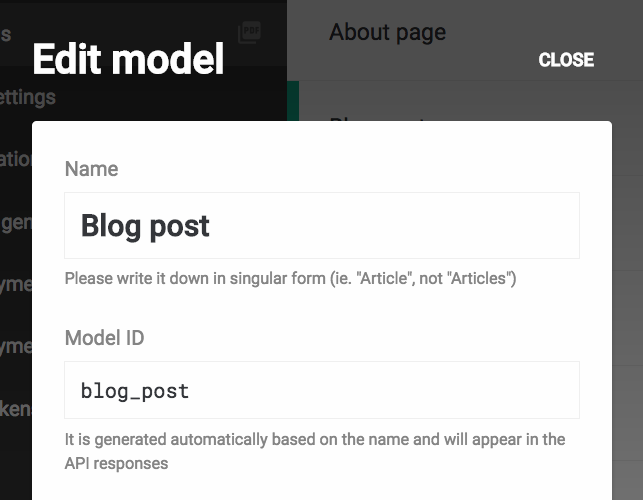
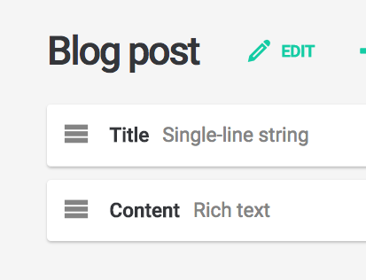

Here are the different methods you can use inside your `dato.config.js` file to retrieve records stored in your administrative area.

### Find a record by ID

If you already know the ID of the record you need to access, just use the `dato.find` method:

```javascript
// dato.config.js

module.exports = (dato, root, i18n) => {
  // returns the record with ID 3411
  dato.find(3411)
}
```

---

### Find all the records of a specific model

Suppose you have a *Blog post* model in your administrative area, and you want retrieve the complete collection of its records. First thing first, you need to know its *Model ID*:




In this case, the ID is `blog_post`, so you can retrieve its records **pluralizing and camel-casing the Model ID**, and using the result as a method on the `dato` object:

```javascript
// dato.config.js

module.exports = (dato, root, i18n) => {

  // iterate over the Array of records of the `blog_post` model
  dato.blogPosts.forEach(record => {
    // ...
  });
};
```

If you need to access the record associated to a [single-instance model](/docs/content-modelling/single-instance), you don't need to pluralize the Model ID:

```javascript
// dato.config.js

module.exports = (dato, root, i18n) => {

  // returns the record for the `about_page` single-instance model
  // (or null, if it hasn't been created yet)
  dato.aboutPage;
};
```
