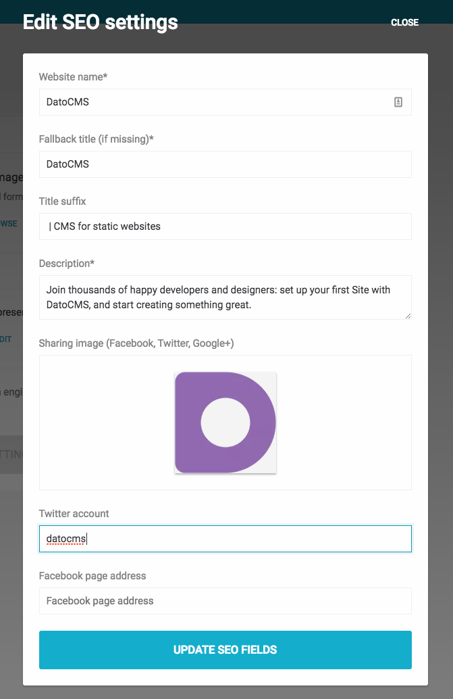
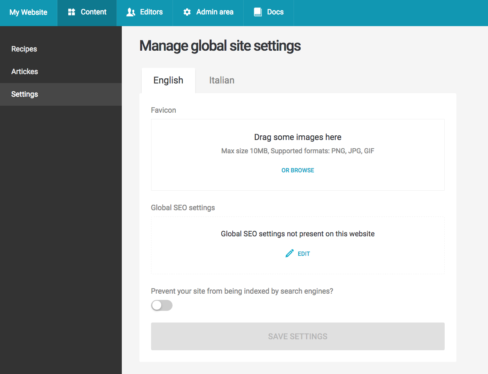

Given a record object, you can obtain its title, description, [OpenGraph](http://ogp.me/) and [Twitter card](https://dev.twitter.com/cards/overview) meta tags with the `.seoMetaTags` method:

```javascript
// dato.config.js

const htmlTag = require('html-tag');

// The `toHtml` function below helps transforming an array of structured objects like this:
// { tagName: 'meta', attributes: { name: 'description', content: 'foobar' } }
// into proper HTML tags:
// <meta name="description" content="foobar" />

const toHtml = (tags) => (
  tags.map(({ tagName, attributes, content }) => (
    htmlTag(tagName, attributes || {}, content)
  )).join("")
);

module.exports = (dato, root, i18n) => {
  root.createPost(`content/about.md`, 'yaml', {
    frontmatter: {
      title: dato.aboutPage.title,
      type: 'about',
      seoMetaTags: toHtml(dato.aboutPage.seoMetaTags),
    },
    content: dato.aboutPage.content
  });
};
```

This will generate a pretty long frontmatter, contaning the complete set of meta tags for the page:

```
---
title: "About me"
type: "about"
seoMetaTags: '<title>About me</title><meta property="og:title" content="About me"><meta...'
---

This is the page content, yay!!
```

Meta tags are generated merging the values present in the record's *SEO meta tags* field together with the *Global SEO settings* you can configure under *Content > Settings*:



If the record doesn't have a *SEO meta tags* field, the method tries to guess reasonable values by inspecting the other fields of the record (single-line strings and images).

Your page title will be composed concatenating the title of the record together with the *Title suffix* setting. If the total length of the title exceeds 60 characters, the suffix will be omitted.

In the templates of your static website, you can then use them inside in your `<head>` section.

---

### Favicon meta tags

Under the *Content > Settings* section you can also configure your website favicon:



You can get desktop, iOS, Android and Windows Phone favicon meta tags with the `dato.site.faviconMetaTags` method:

```javascript
// dato.config.js

module.exports = (dato, root, i18n) => {

  // Create a YAML data file to store global data about the site
  root.createDataFile('data/settings.yml', 'yaml', {
    faviconMetaTags: toHtml(dato.site.faviconMetaTags),
  });
};
```

This will be the content of `src/data/settings.yml`:

```yaml
faviconMetaTags: '<link rel="apple-touch-icon" sizes="57x57" href="https://www.datocms-assets.com/604/123-favicon.png?h=57&w=57"><link rel="apple-touch-icon" sizes="60x60" ...'
```

You can then use the generated snippet in the `<head>` section of your static website.
