Netlify is a very interesting service that combines a continuous deployment system with a powerful CDN optimized to host static websites. It's probably the easiest solution out there if you're exploring the world of static websites for the first time; furthermore, their free plan is perfectly compatible with DatoCMS and allows you to publish high-performant static websites.

**Warning:** this guide assumes you have a working static website project on your machine integrated with DatoCMS. If it's not the case, you can return to the [previous sections](/docs/general-concepts) of this documentation to see how to properly configure the DatoCMS administrative area and how to integrate DatoCMS with your favorite static website generator. 

### Step 1: create your Git repository

Create a new repository on [GitHub](https://github.com/new). To avoid errors, do not initialize the new repository with README, license, or gitignore files. You can add these files after your project has been pushed to GitHub.

```bash
$ git init
$ git add .
```

Commit the files that you've staged in your local repository.

```bash
$ git commit -m 'First commit'
```

At the top of your GitHub repository's Quick Setup page, click the clipboard icon to copy the remote repository URL. In Terminal, add the URL for the remote repository where your local repository will be pushed.

```bash
$ git remote add origin YOUR_GITHUB_REPOSITORY_URL
```

Now, it's time to push the changes in your local repository to GitHub.

```bash
git push -u origin master
```

Now that your project is up and running on GitHub, let's connect it to Netlify.

### Step 2: connect your repo to Netlify

Creating a new site on Netlify is simple. Once you've logged in, you'll be taken to https://app.netlify.com/sites. If you're just starting out, there's only one option:

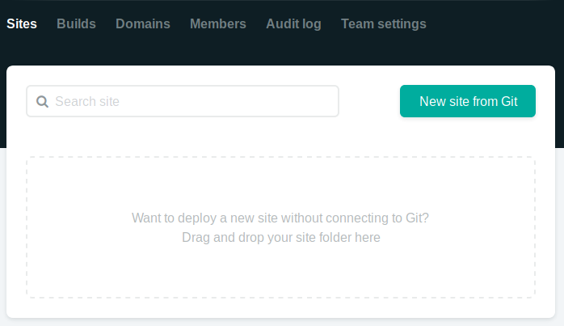

Clicking "New Site" brings you to this screen:

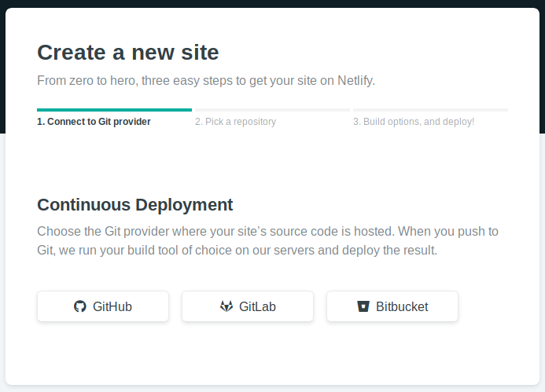

Once you click on the "Link to GitHub" button, it will present the following screen:

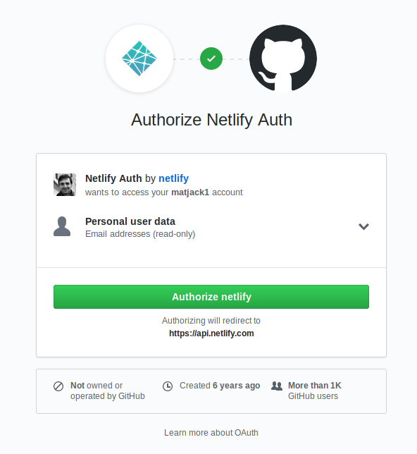

Click the "Authorize Application" button to let Netlify read the list of your Github repositories. Like it says in the image above, Netlify doesn't store your GitHub access token on their servers. Once you've connected Netlify and GitHub, you can see a list of your Git repos. Select the one we just created:

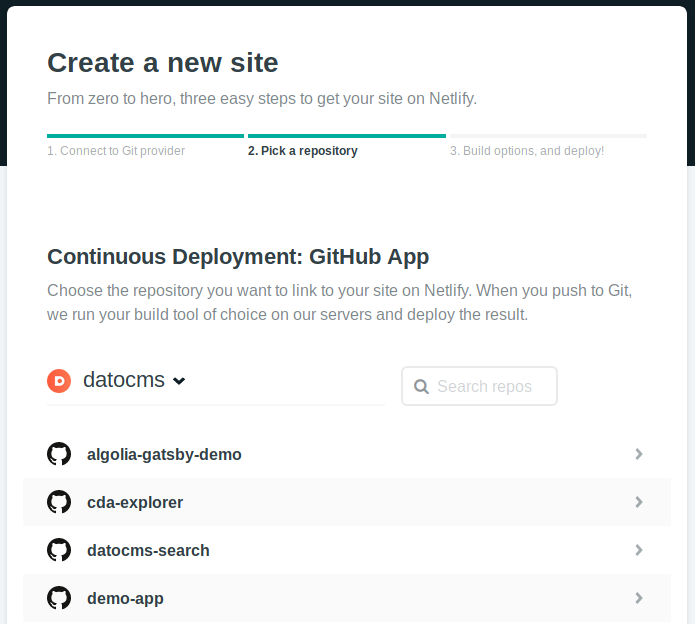

The next screen is extremely important: it's where you instruct Netlify to build your static website:

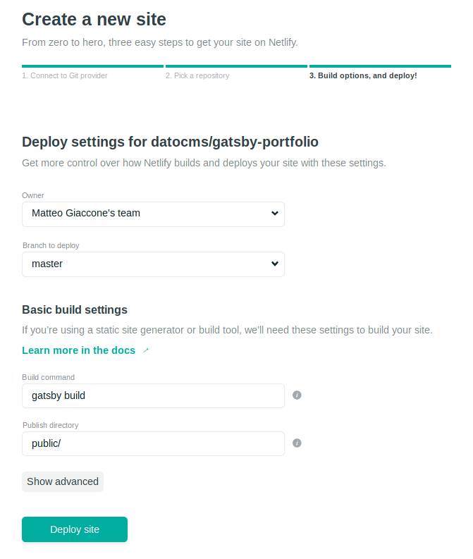

Depending on your static generator the **Build command** and **Publish directory** field need to be filled with different values:

| SSG        | Build command                                       | Publish directory |
|------------|-----------------------------------------------------|-------------------|
| Jekyll     | `bundle exec dato dump && bundle exec jekyll build` | `public/`         |
| Hugo       | `dato dump && hugo`                                 | `public/`         |
| Middleman  | `bundle exec middleman build`                       | `build/`          |
| Metalsmith | `dato dump && node index.js`                        | `build/`          |
| Hexo       | `dato dump && hexo generate`                        | `public/`         |
| Gatsby     | `gatsby build`                                      | `public/`         |

In the *Site Settings*, make sure you add your DatoCMS read-only token as a `DATO_API_TOKEN` environment variable:

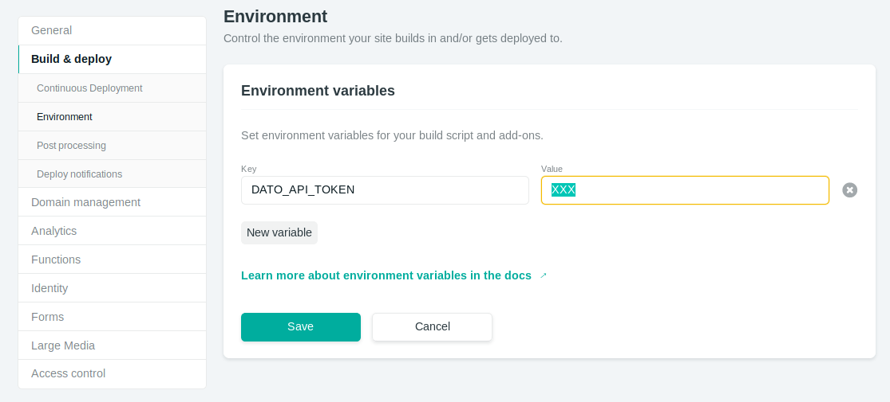

You can find your API token in the *Settings > API tokens* section:


Once everything is ready, press the *Build your site* button. Netlify will run the build process for the first time and you can watch the progress of the operation.

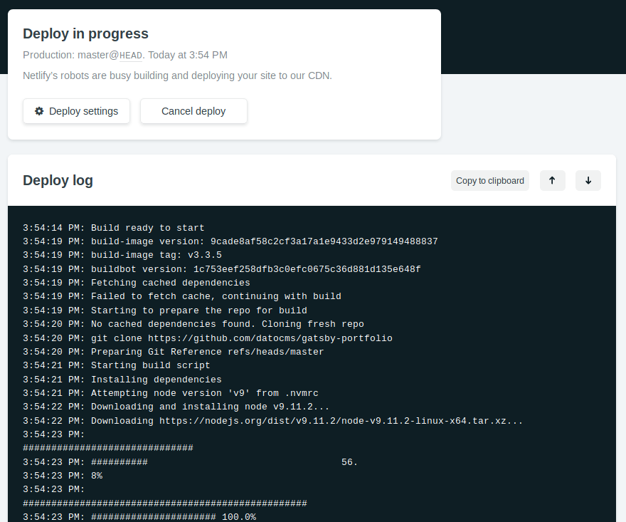

Once the build process if finished, Netlify will publish under a temporary domain the directory specified earlier. Now everytime you push some change to GitHub, Netlify will repeat the build process and deploy a new version of the site. 


### Step 3: connect Netlify to DatoCMS

There's only one last step needed: connecting DatoCMS to Netlify, so that everytime one of your editors press the *Publish changes* button in your administrative area, a new build process (thus a new publication of the final website) gets triggered.

To do so, go to the *Settings > Environments*, add a new one and select *Netlify* as build method:

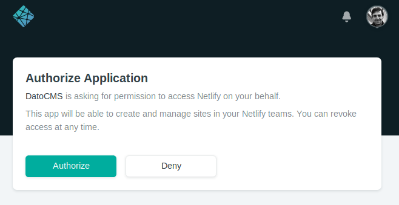

On the new window that pops up, click on "Grant Access" to allow DatoCMS to setup the auto-deploy meachanism for you:


Select the Netlify site that you want to link to DatoCMS, so that a number of bi-directional hooks willl be configured for you:

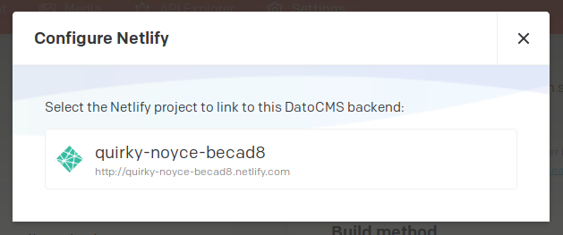

You can specify which branch of your Git repository you want to link and build with the deployment environment that you are creating:

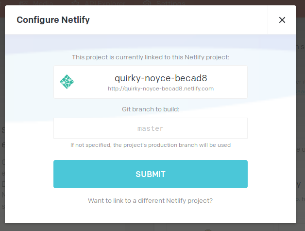

When everything is done, confirm the integration pressing the **Save Settings** button:

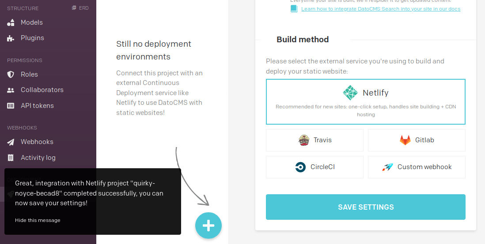
