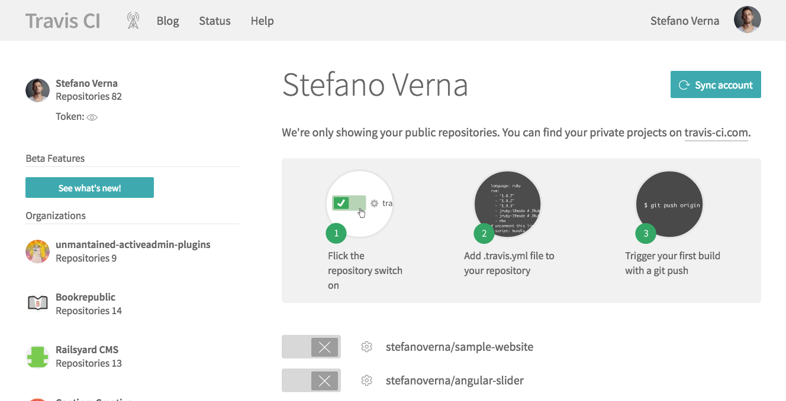
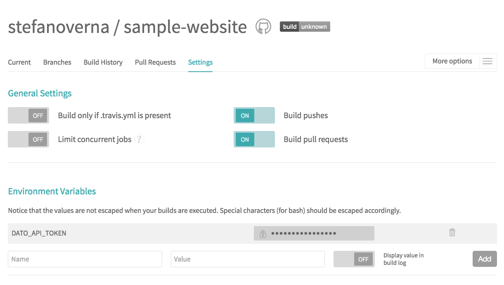
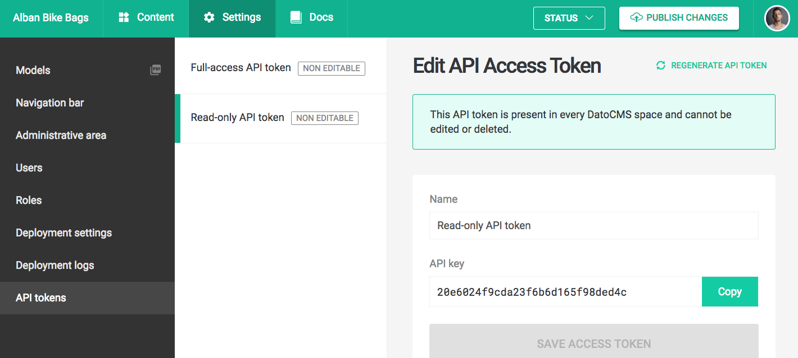
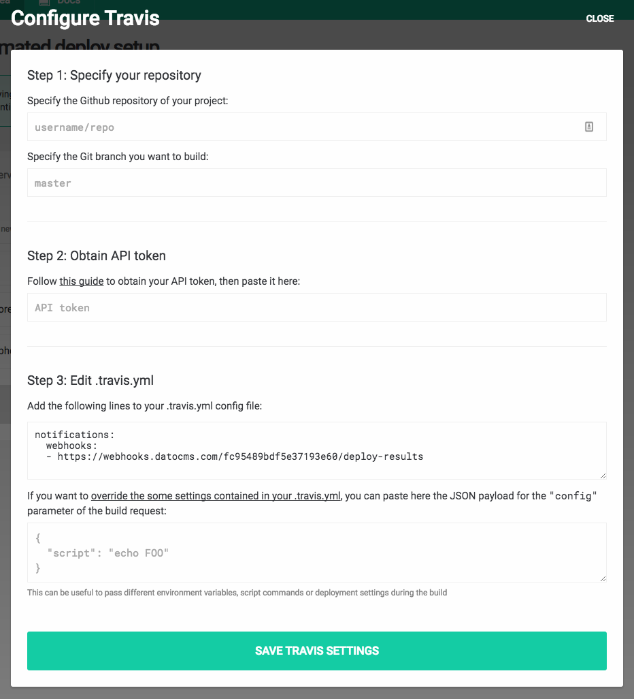

**This guide assumes you have a working static website project on your machine integrated with DatoCMS.** If that's not your case, you can return to the previous sections of this documentation to see how to properly configure the DatoCMS administrative area and how to integrate DatoCMS with your favorite static website generator. 

### Create your Git repository

Create a new repository on [GitHub](https://github.com/new). To avoid errors, do not initialize the new repository with README, license, or gitignore files. You can add these files after your project has been pushed to GitHub.

```bash
$ git init
$ git add .
```

Commit the files that you've staged in your local repository.

```bash
$ git commit -m 'First commit'
```

At the top of your GitHub repository's Quick Setup page, click the clipboard icon to copy the remote repository URL. In Terminal, add the URL for the remote repository where your local repository will be pushed.

```bash
$ git remote add origin YOUR_GITHUB_REPOSITORY_URL
```

Now, it's time to push the changes in your local repository to GitHub.

```bash
git push -u origin master
```

Now that your project is up and running on GitHub, let's connect it to Travis.

### Enable TravisCI

[Sign in to Travis CI](https://travis-ci.org/auth) with your GitHub account, go to your [profile page](https://travis-ci.org/profile) and enable Travis CI for the repository you want to build.



### Add the DatoCMS API token as environment variable

Reach the TravisCI settings page of your project, and add an environment variable called `DATO_API_TOKEN` containing the read-only API token of your DatoCMS administrative area:



You can find the API token in the *Admin area > API tokens* section:



### Configure .travis.yml

The next step is to add a `.travis.yml` file to your repository. Travis CI uses this file in the root of your repository to learn about your project and how you want your builds to be executed. How this file needs to be structured differs a lot depending on the static website generator you are using. Here we'll show you some examples to get started. 

Please refer to the official TravisCI documentation to learn everything regarding [how to configure your build](https://docs.travis-ci.com/user/customizing-the-build/) and how to properly [deploy the actual website to S3](https://docs.travis-ci.com/user/deployment/s3).

#### Jekyll

```yaml
language: ruby
script:
  # first dump all the remote content as local files
  - bundle exec dato dump
  # then generate the website
  - bundle exec dato jekyll build
deploy:
  provider: s3
  access_key_id: XXX
  secret_access_key: YYY
  bucket: your-bucket
  local_dir: public
  skip_cleanup: true
  acl: public_read
```

#### Hugo

```yaml
language: node_js
sudo: required
before_script:
  # download latest version of hugo
  - wget https://github.com/spf13/hugo/releases/download/v0.19/hugo_0.19-64bit.deb
  # install it
  - sudo dpkg -i hugo*.deb
script:
  # first dump all the remote content as local files
  - ./node_modules/.bin/dato dump
  # then generate the website
  - hugo
deploy:
  provider: s3
  access_key_id: XXX
  secret_access_key: YYY
  bucket: your-bucket
  local_dir: public
  skip_cleanup: true
  acl: public_read
```

#### Middleman

```yaml
language: ruby
script:
  - bundle exec middleman build
deploy:
  provider: s3
  access_key_id: XXX
  secret_access_key: YYY
  bucket: your-bucket
  local_dir: build
  skip_cleanup: true
  acl: public_read
```

#### Metalsmith

```yaml
language: node_js
script:
  # first dump all the remote content as local files
  - ./node_modules/.bin/dato dump
  # then generate the website
  - node index.js
deploy:
  provider: s3
  access_key_id: XXX
  secret_access_key: YYY
  bucket: your-bucket
  local_dir: build
  skip_cleanup: true
  acl: public_read
```

### Connect TravisCI to DatoCMS

There's only one last step needed: connecting DatoCMS to TravisCI, so that everytime one of your editors press the *Publish changes* button in your administrative area, a new build process (thus a new publication of the final website) gets triggered.

To do so, go to the *Admin area > Deployment settings* and select *TravisCI*:


In the window that will appear, follow the instructions to conclude the integration:



When everything is done, confirm the integration pressing the *Save Settings* button.

