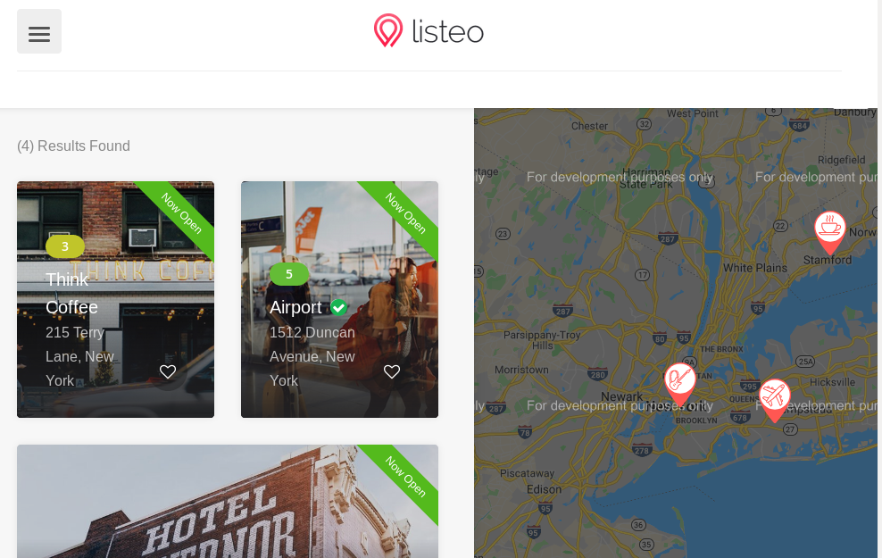

A slightly more complex demo, always using GraphQL APIs.

An Airbnb-inspired demo project:

[Check out the live version](https://react-demo-airbnb.netlify.com/).

You can [find the code on Github](https://github.com/datocms/react-demo) or you can set up the demo by clicking on the following button:

