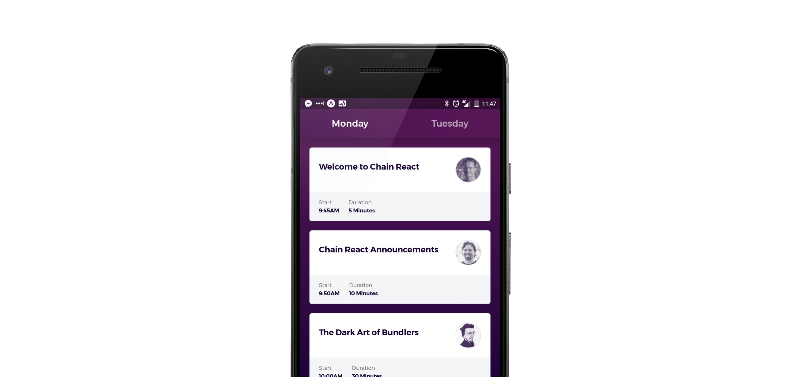

One of the main features of an headless CMS is its omni-channel capabilities by default. You can pull content from wherever you want!

For example you can build an app using React Native:

You can [see it live here](https://expo.io/@mat_jack1/datocms-wmf) using the [Expo client](https://expo.io/tools#client).

Find all the code in [this Github repo](https://github.com/datocms/react-native-demo) or set up the demo by clicking on the following button:

